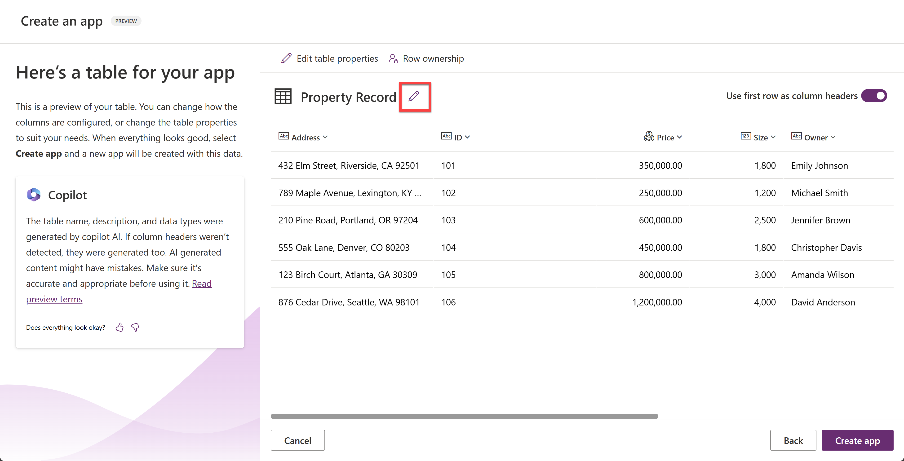
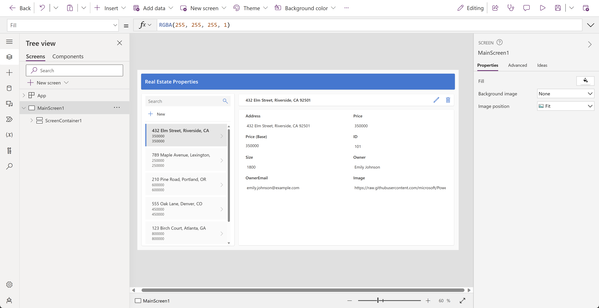
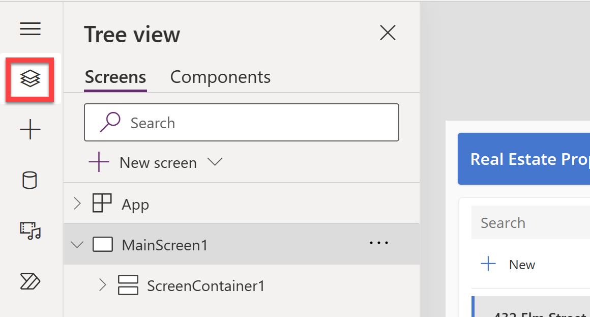

# Building a Power Apps Canvas App for a real estate solution with data from Excel

In this module, you will begin creating a Power Platform solution which revolves around a real estate company and its operations, starting with a Power Apps Canvas App that will be used by the real estate agents to manage their properties. The data for this app is stored in an Excel file and you will use the AI Copilot Excel to App functionality to create the app. You’ll also use Power Apps Ideas to generate and speed up the formula authoring experience to add additional functionality to the app.

**Learning Objectives**

In this module, you will:

- Create a Canvas App using Excel to App
- Customize galleries by using Power Apps Ideas to generate Power Fx formulas

**Prerequisites**

- You'll need a Power Apps Developer environment (based in the United States region) with a licensed user to complete these exercises
- Download the [RealEstateProperties.xlsx](assets/RealEstateProperties.xlsx) Excel file

## Introduction to Excel to App

With Excel to App, you'll select an Excel file, create an app, and then run the app that you create. Every app created includes screens to browse records, show record details, and create or update records. By generating an app, you can quickly get a working app using Excel data, and then you can customize the app to better suit your needs.

When you upload an Excel file it generates a Dataverse table. With Dataverse's standard and custom tables, you can securely store your data in the cloud. These tables enable you to define your organization's data in a way that is tailored to your business needs, making it easier to use within your apps.

If your environment is in the US region and AI is enabled in your organization, the AI Copilot feature can assist in table creation by suggesting table names, descriptions, column data types, and headers, even if this information is missing from the uploaded file. When Copilot AI is used for table creation, the Copilot card is displayed to indicate that the table was generated by Copilot AI.

## Exercise – Create a Canvas App with data from an Excel file

In this unit, you’ll create a mobile application with data from an Excel table.

> [!NOTE]
>
> Power Apps requires either a Microsoft 365 license or a free trial. Learn more about your licensing options. [Microsoft products include Microsoft Power Apps and Power Automate](https://learn.microsoft.com/en-us/power-platform/admin/pricing-billing-skus).

1. Go to [make.powerapps.com](https://make.powerapps.com/) and **Sign In** with your Power Apps credentials.

2. From the Power Apps home screen, select **Start with data**.

    

3. Then select **Upload an Excel file**.

    

4. Click **Select from device** and navigate to the location where the **RealEstateProperties.xlsx** Excel file is saved and upload it. The maximum file size limit is 5 GB.

    

5. A table which is based on the data from the RealEstateProperties.xlsx Excel file will be generated. Click the pencil edit icon next to the table name to change it.

    

6. On the **Edit Table** pop up, enter **Real Estate Property** as the Display name, **Real Estate Properties** as the Plural Name, and make sure that **Address** is selected as the Primary column. Select **Save**.

    

7. Select the **Create app** button on the bottom right-hand corner of the screen.

    

8. When the app first loads, a dialog may appear saying: **Welcome to Power Apps Studio**. If so, select the Skip button.

9. You should now be viewing the app that has been generated for you in Edit mode.

    

10. To the left of the screen, select the **Data** icon from the navigation bar. Notice that a Dataverse table, based on the **RealEstateProperties.xlsx** Excel file, has been created.

    

11. Select the **Tree view** icon to return to the Tree view.

    

12. On the app main screen, click on the gallery displaying the Real Estate Properties and then click on **RecordsGallery1** in the Tree view to expand it.

    

13. Select the **ellipsis (…)** next to the NextArrow and delete it.

    

14. Select the **RecordsGallery1** and then select the edit button to put the gallery in edit mode.

    

15. Reduce the width and move the position of the **Title** component so that it is towards the right-hand side of the template cell.

    

    The other components should reposition alongside the Title component. If not, then move them until it looks like the screenshot above.

16. Make sure that the gallery is still in edit mode. Select the **Title**.

17. Make sure that the **Text** value of the **Title** component is set to the following formula:

    `ThisItem.Address`

    

18. Now select the **Subtitle** component in the gallery.

19. Set the **Text** value of the **Subtitle** to the following formula:

    `ThisItem.Size`

20. Using the tool bar at the top of the page, change the **Size** to 13.

    

21. Finally, select the **Body** component in the gallery.

22. Set the **Text** value of the **Body** to the following formula:

    `ThisItem.Price`

23. Your gallery should now look like this:

    

24. Select the **RecordsGallery1** and then select the edit button to put the gallery in edit mode. Then click on **Insert >** search for **Image >** and then select the **Image** component.

    

25. The image will then be added to your gallery. Reposition and resize the image so that it is in the center of each gallery cell.

    

26. Now to use Power Apps Ideas. Make sure the gallery is still in edit mode. And select the gallery body containing the Price. Then select the **arrow** next to the lightbulb icon which appears above it. Next, select **Text formatting**.

    

27. Enter this output in the Desired format text box:

    `$350,000`

    Then press **Enter**.

    

28. Select the generated formula. Then select Apply.

    

    > [!NOTE]
    >
    > With Power Apps Ideas, the example \($350,000\) which you gave generated a formula:
    >
    > `(Text(ThisItem.Price, "$#,##0", "en-US"))` which is now updated in the formula bar for the Price gallery control.

29. Now let’s do the same for the **Size** control in the subtitle of the gallery. Make sure the gallery is in edit mode. And select the subtitle containing the Size. Then select the **arrow** next to the lightbulb icon which appears above it. Next, select **Text formatting**.

30. Enter this output in the Desired format text box:

    `Size: 1,800 sq ft`

    Then press **Enter**.

    You may notice that the ideas section is empty. This may be caused by the lack of information or context required to generate a formula.

    

31. So, let’s add more examples. Click **+ Add examples** at least 2 more times.

    

32. Select 2 Current formats and then provide 2 corresponding Desired formats.

    

33. With the added context, Power Apps Ideas now generates a suitable formula for you:

    

34. Select the **generated formula**. Then select **Apply**.

    Your gallery should now be looking like this:

    

35. **Save** the app.

36. **Exit** the app to return to the Power Apps home page.

    

## Check your knowledge

Answer the following questions to see what you've learned.

1. What is the primary purpose of the Excel to App feature in Power Apps?

   - It allows you to create a Power Pages website with data from an Excel file
   - It allows you to create a Model-Driven App with data from an Excel file
   - **It allows you to create a Canvas App with data from an Excel file**
   - It allows you to create a Canvas App with data from a Word file

2. What is the maximum file size limit for the Excel file that can be uploaded to Power Apps?

   - 1 GB
   - 2 GB
   - 3 GB
   - **5 GB**

3. After uploading an Excel file in Power Apps using Excel to App and creating the app, which data source is used?

   - **Dataverse**
   - SharePoint
   - OneDrive
   - SQL Server

## Summary

In this module, you starting building a Power Platform solution which revolves around a real estate company and its operations, starting with a Power Apps Canvas App that will be used by the real estate agents to manage their properties.

The data for this app was stored in an Excel file and you used the AI Copilot Excel to App feature to create a Canvas App with data from the Excel file. You also learned how to use Power Apps Ideas to generate and speed up the formula authoring experience to add additional functionality and formatting to the app.