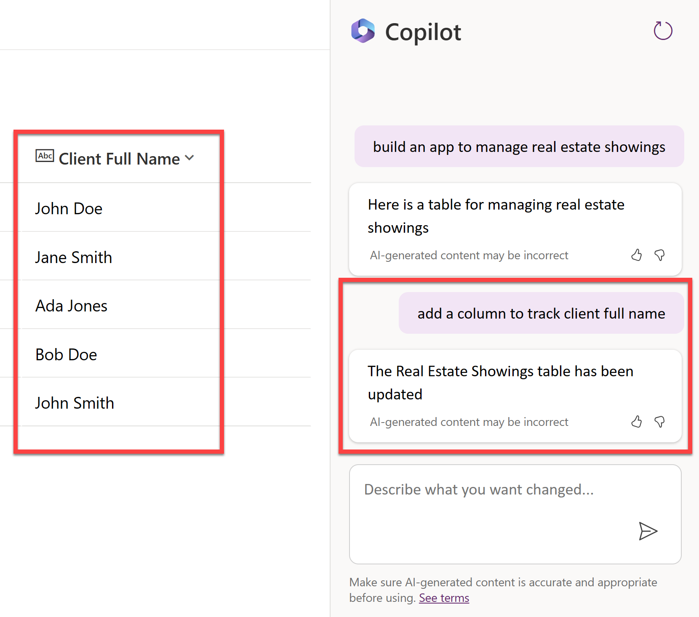
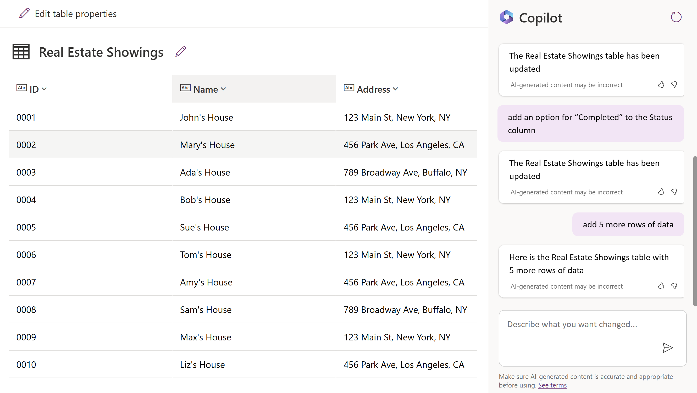
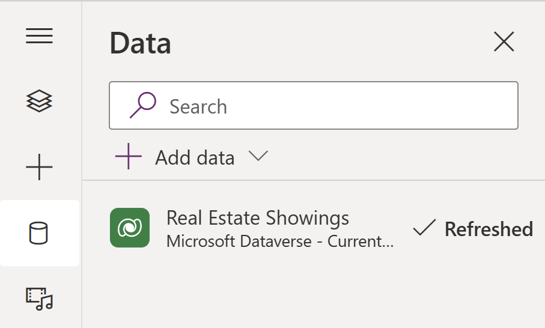
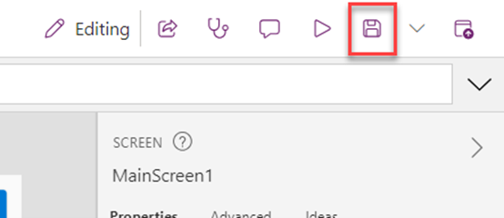

# Building a Power Apps Canvas App for a real estate solution with Power Apps Copilot

In this module, you will be exploring AI to generate a table of data and creating a new app within Power Apps using the Copilot tool.

**Learning Objectives**

In this module you’ll:

- Create a Canvas App using Power Apps Copilot
- Customize the Dataverse table data generated by Copilot
- Add a lookup column to link this app to the one created in the previous module
- Add additional data to the table

**Prerequisites**

- You'll need a Power Apps Developer environment (based in the United States region) with a licensed user to complete these exercises.
- Complete the previous module in this Learning Path

## Introduction to Power Apps Copilot

With Power Apps Copilot, you can build an app, including the data behind it, just by describing what you need through multiple steps of conversation. Your apps will have copilot-powered experiences built in from the first screen—so your users can discover insights in conversation instead of mouse-clicks.

The AI assistant is available from the Power Apps home screen. You can tell the AI assistant what kind of information you want to collect, track, or show and the assistant will generate a Dataverse table and use it to build your canvas app.

## Exercise – Create a Canvas App with Power Apps Copilot

In this unit, you’ll create a mobile application leveraging Power Apps Copilot. This app will be used by field agents to browse real estate inventory and manage appointments for showings and the data will be stored in Dataverse.

> [!NOTE]
>
> Power Apps requires either a Microsoft 365 license or a free trial. Learn more about your licensing options. [Microsoft products include Microsoft Power Apps and Power Automate](https://learn.microsoft.com/en-us/power-platform/admin/pricing-billing-skus).

> [!NOTE]
>
> Within this lab, notice that your results for data may vary from those within the screenshots and images throughout the lab. This is because Power Apps is using OpenAI to generate data for the lab that changes daily.

1. In the center of the Home page within Power Apps, there's a text field in which you can enter a prompt to search for an AI generated table.

    Within the text field type the following prompt:

    `build an app to manage real estate showings`

    Then, select the **Send** button.

    

2. After the AI Copilot generates a table based on your prompt, look through the table to see what columns have been created for the start of your table.

    

    Let's explore further within modifying and adding to the already generated table.

3. In the text box, at the bottom of the **Copilot** pane to the right of the screen, type:

    `add a column to track client full name`

    Then, select the **Send** button.

    You'll see that Copilot has provided feedback that the table has been updated and you should also see the new column added to the table:

    

4. Now type the following into the chat:

    `add a column to track client email`

    Then, select the **Send** button.

    Notice how a new column has been added to the table displaying the client’s email:

    

    > [!NOTE]
    >
    > Remember that the data that is generated in your table may vary from the data shown within the table in the screenshots and images for the lab.

    > [!NOTE]
    >
    > In the bottom left corner of the screen, notice that there is a section titled Suggestions. This section provides you with different suggestions on how you can add to and modify your table.

    

    Notice that to the right of the screen, it appears to look as if you're having a conversation with a Copilot AI bot while adding to and modifying your table. Here's where you can scroll through and view the changes or additions you have made to your table.

    

5. Now, let’s edit the **Status** column within the table. In the text box within the **Copilot** pane, type and send:

    `add an option for “Completed” to the Status column`

    It may take a minute to load. Once it does, you'll see that the **Status** column has been updated to include the option for **Completed**.

6. Select the **Status** column name **drop down**, and select **View column**. Here, you can view the columns’ properties and the current status details and data.

    

    > [!NOTE]
    >
    > If your column choices are not the same as the ones shown in the screenshot - you can type the following command into the **Copilot** pane text box and send:
    >
    > `the status choices should be Pending, Confirmed, Cancelled, and Completed`

    Select the **X** in the top right corner of the pane to close out.

    Let's try adding more data to our table and the existing columns. 

7. Within the **Copilot** pane text box, type and send:

    `add 5 more rows of data`

    Notice that five more rows of data are added for each of the existing columns within the table.

    

    Now looking through your table, you should have a number of columns. However, for the sake of following the rest of the modules in this learning path - let's try and remove some of the columns that we won't be using.

    The list of columns that we will need going forward are:

    - ID
    - Address
    - Date
    - Time
    - Status
    - Agent name
    - Client Full Name
    - Client Email

    Use what you've just learnt with the **Copilot Chat** window to adjust your table to match the above. Don't forget to reference the Suggestions section for help in case you need to remove a column, change a column name, or add a column.

8. Let's create the app now. In the bottom right corner of the screen, select the **Create app** button.

    

9. When the app first loads, a dialog may appear saying: **Welcome to Power Apps Studio**. If so, select the **Skip** button.

    You should now be viewing the app, that has been built for you, in **Edit** mode:

    

10. To the left of the screen, select the **Data** icon from the navigation bar. Notice that a **Dataverse** table has been created by the Copilot and is now in the **Environments** section.

    

    > [!NOTE]
    >
    > Copilot is currently only supported for Dataverse. You cannot use any other data access point at this time.

    Let's try editing the table now that the app has been created.

11. Within the **Data** pane, hover over the table. To the right of the table, select the **ellipsis** (...).

12. From the menu, select **Edit data**.

    

13. The Edit Table dialog appears. Here's where you can come and add your own columns to the table, or modify existing columns.

    

14. Select the **ID** column header from the table.

15. From the drop-down, select the **Edit column** option.

    

    In this example, we don't want the Data Type of the column to be a Single line of text. Let's change that.

16. Within the Edit column pane, from the **Date type** drop-down select **# Autonumber**.

17. Select **Save**.

    

18. Select the **Close** button in the bottom right corner of the **Edit table** dialog.

19. Notice that the table now says **Refreshed** within the Data pane.

    

20. We have to modify the gallery in the application so that it displays the relevant data. Select the **Tree view** icon to return to the Tree view.

21. On the app main screen, click on **RecordsGallery1** displaying the **Real Estate Showings** and then select the edit button to put the gallery in edit mode.

22. Select the **Title** and set the **Text** value to the following formula:

    `ThisItem.Address`

23. Select the **Subtitle** and set the **Text** value to the following formula:

    `ThisItem.'Client Email'`

24. Select the **Body** and set the **Text** value to the following formula:

    `ThisItem.Status`

    A single record in the gallery should now look like this:

    

25. On the app main screen, select the **Form** control.

    

26. On the **Properties** pane on the right, under the **Fields** property, select **Edit fields**.

    

27. Now within the **Fields** pane, expand the **ID** field.

28. From the **Control type** drop-down, change the type to **View text**.

    

    Because we previously changed the ID field to Autonumber, we don’t want the users putting in their own number; Dataverse is going to autonumber it for us.

29. Within the **Fields** pane, use the **X** in the top right corner to close out the pane.

30. Now, let's make a new request for a property showing within the app.

31. From the top of the screen, select the Play button.

    

32. Within the pane to the left of the app, select the **+New** button.

    

33. Although you could modify the form to autofill the fields for you, we're going to do so ourselves to show that the app works.

34. Fill in the following fields with the information below:

    - Agent Name: < Your name >
    - Client Full Name: < Your name >
    - Client Email: < Your email >
    - Date: < Any future date >
    - Time: < Any future time >
    - Status: `Pending`
    - Address: `210 Pine Road, Portland, OR 97204`

    > [!NOTE]
    >
    > This address is one of the addresses from the Excel file in Module 1. The same file which we uploaded and turned into the **Real Estate Properties** table.
    >
    > Usually, you would have a lookup field to the **Real Estate Properties** table, but we're going to keep it simple for this lab.

35. Then select the checkmark in the top right corner of the screen.

    

36. Now, select the **X** in the top right corner to close out of the app.

    If a dialog appears saying: **Did you know?**, select OK.

    Notice that the new request has been added to the list of requests to the left of the app.

37. From the top of your screen, select the **Save** button to save the new app you have created.

    

    If asked, save app name as **Real Estate Showings**.

38. Exit the app to return to the Power Apps home page.