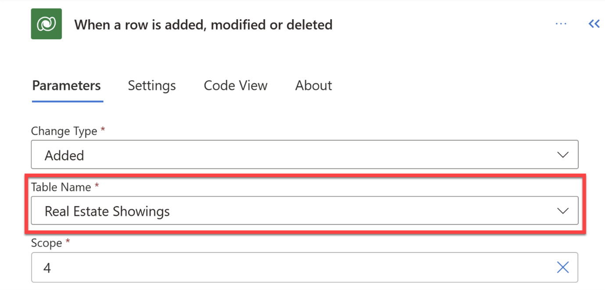
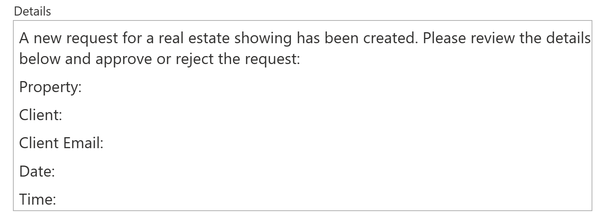
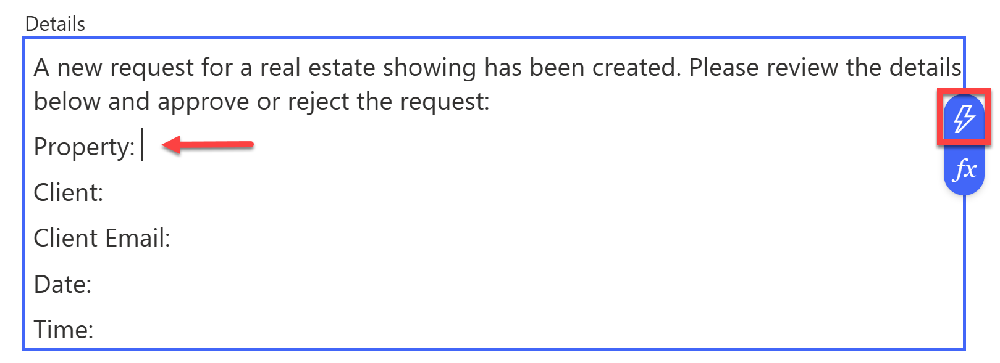
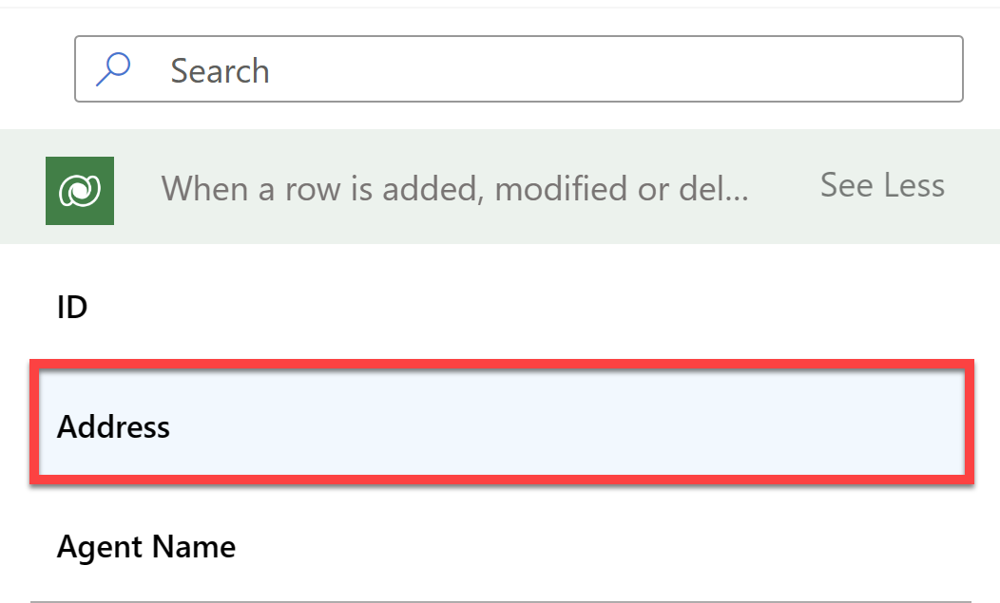
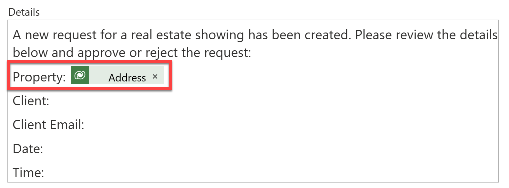
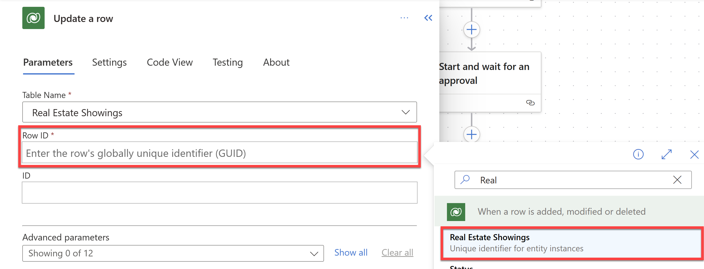
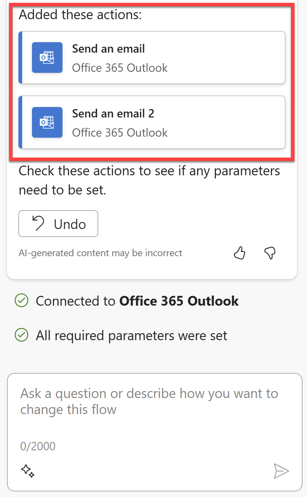
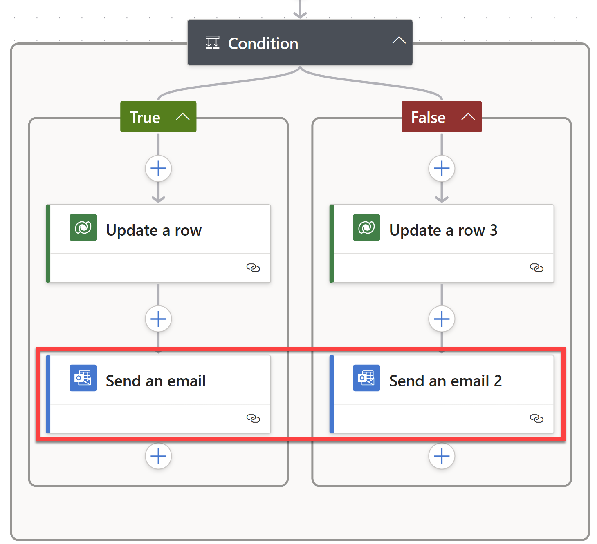
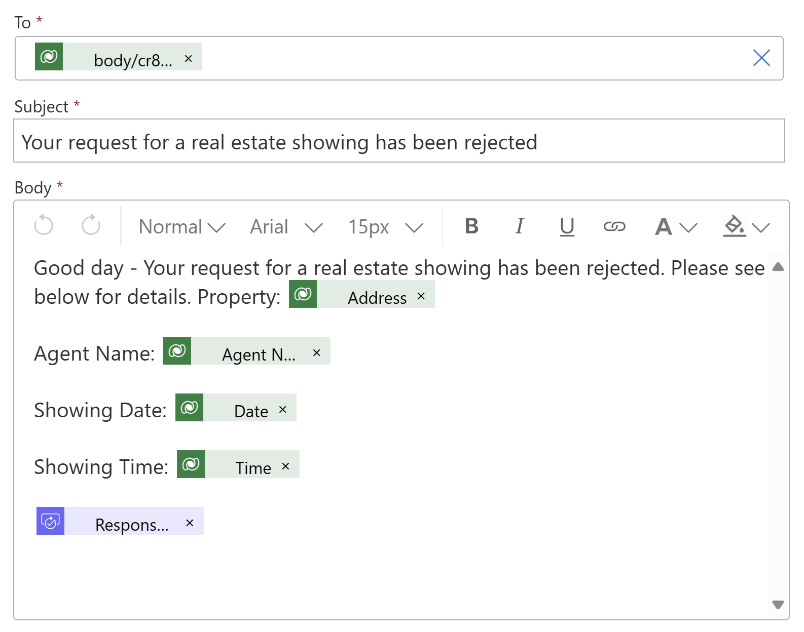
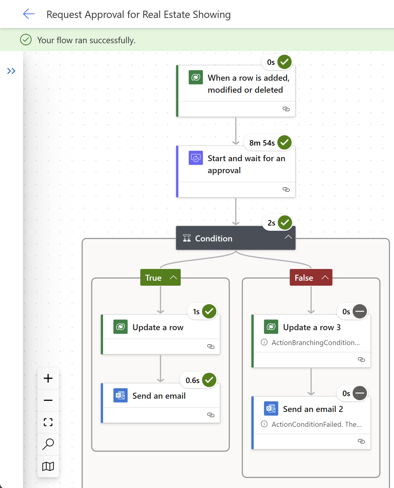

# Building Power Automate flows for a real estate solution with Power Automate Copilot

This module will cover creating flows using the Power Automate Copilot. It will show how to refine your flow with the copilot as well as how to use the format by example AI capabilities.

Copilot in Power Automate is the perfect tool to help you automate tedious tasks and save time. It's easy to use and you can now create workflows faster and more efficiently.

**Learning Objectives**

- Evaluate the features and capabilities of Copilot in Power Automate.
- Describe how to create and manage flows with Copilot in Power Automate

**Prerequisites**

- A Power Automate license
- A Power Platform environment in a US preview region

## Introduction to Power Automate Copilot

Copilot is like having your own virtual assistant in Power Automate! It's a powerful feature that makes workflow automation a breeze. It uses AI and machine learning to analyze your processes and generate smart suggestions for actions and automations. The best part? You don't need to be a coding expert to benefit from Copilot. It's designed to help you create efficient workflows without the hassle of complex programming.

Power Automate makes it possible for you to not just describe a flow to create, but also improve and iterate on your flows with AI-driven conversations. This next-generation AI-based Copilot in Power Automate sits inside the flow studio and helps with every flow that’s being built or changed.

Copilot in Power Automate allows open-ended and conversational experiences while authoring your flows. As you build, you’ll be able to ask questions and get assistance making improvements and changes. You won’t need any special knowledge of how Power Automate works. Just by using natural language, you’ll be able to build and enhance everything from a simple flow to a complex, robust enterprise-wide process.

## Exercise – Create an Approval Flow with Power Automate Copilot

In this unit, you’ll create an automation with Power Automate Copilot to automate the approval process for a real estate showing. You’ll use the Copilot to create a flow that will send an email to the real estate agent when a new showing is requested. The agent will then be able to approve or reject the showing request from within the email.

Follow these steps to create a flow using Copilot.

1. Sign in to [Power Automate](https://make.powerautomate.com/).

2. In the center of the **Home** page within Power Automate, there’s a text field in which you can enter a prompt to **Start building your flow with Copilot**

    Type the following prompt:

    `request approval when a dataverse record is created`

    Select the **Submit** button

    

3. From the prompt, Copilot will provide the outline for a suggested flow which you can review. To accept the flow, select **Next**.

    

4. Review the connected apps and services. If a connection has not been made yet, configure or fix it. Then select **Create flow**.

    

    The Edit with Copilot designer opens with your flow along with a Copilot chat window on the right:

    

5. We need to configure some parameters. Select the **When a row is added, modified or deleted** trigger.

    A panel on the left-hand side of the screen shows the trigger details, including an empty Table name parameter which is required.

    

6. From the **Table Name** dropdown, search for and select **Real Estate Showings**.

    

7. Select the **Start and wait for an approval** action.

    Notice that the **Approval Type** parameter is missing:

    

8. From the **Approval Type** dropdown, select **Approve/Reject - First to respond**.

    Notice how as soon as you select the **Approval Type**, additional parameters now become available:

    

9. In the Copilot chat window, type the following prompt:

    `Add "New Request for Real Estate Showing" as the Title parameter for the Start and wait for an approval action`

10. It will take a few seconds for Copilot to process the prompt. When it does, the **Title** parameter will be populated with the prompt text:

    

11. For the **Assigned To** parameter, type in the email address that you're using for this lab. This will be the email address that receives the approval request.

12. Now for the **Details** parameter, type in the following:

    ```
    A new request for a real estate showing has been created. Please review the details below and approve or reject the request:

    Property: 
    Client: 
    Client Email:
    Date:
    Time: 
    ```
    

13. Next, place your curser next to "Property: " in the **Details** parameter and click on the lightning icon to open the **Dynamic Content** pane.

    

14. In the **Dynamic Content** pane, select **See More** to expand the list of available dynamic content.

    

15. Scroll down until you see the **Address** field and select it.

    

    The **Address** dynamic content field is now added to the **Details** parameter:

    

16. Now do the same for the **Client**, **Client Email** , **Date**, and **Time** fields.

    Once you're done with the rest of the fields, it should look like this:

    

17. With the **Details** parameter completed, you can now collapse the **Start and wait for an approval** action by selecting the double arrow icon.

    
    
18. Now select the **Condition** action.

    

19. Select the **Choose a value** box and select **Outcome** from the **Dynamic content** pane.

    

20. Select **is equal to** for the condition and then type `Approve` for Value.

    

21. Collapse the **Condition** action and then select the **Update a row** action under the **True** branch of the Condition.

22. From the **Table Name** dropdown, search for and select **Real Estate Showings**.

23. Select the **Row ID** field and then select the **Real Estate Showings** unique identifier field from the **Dynamic content** pane.

    

    Every time you create a table in Dataverse, a column is automatically created with the same name of the table. This column serves as the unique lookup ID for the record (or row) that was created.

24. Select **Show all** under **Advanced Parameters**.

    

25. Select **Confirmed** from the **Status** dropdown menu.

    

    When a showing is approved, the **Status** field in the **Real Estate Showings** table will be updated to **Confirmed**.

26. Collapse the **Update a row** action and then select the **Update a row** action under the **False** branch of the Condition.

27. From the **Table Name** dropdown, search for and select **Real Estate Showings**.

28. Select the **Row ID** field and then select the **Real Estate Showings** unique identifier field from the **Dynamic content** pane.

29. Select **Show all** under **Advanced Parameters**.

30. Select **Cancelled** from the **Status** dropdown menu.

    When a showing is rejected, the **Status** field in the **Real Estate Showings** table will be updated to **Cancelled**.

31. Collapse the **Update a row** action.

32. In the Copilot chat window, type the following prompt and submit:

    `Under the "Update a row" action for both branches in the condiiton, add a new "Send an email (V2)" action`

    After a few seconds, Copilot should then explain what it did:

    

    You should then see the updated flow:

    

33. Select the **Send an email** action under the **True** branch of the Condition.

34. Select the **To** field, remove the "example@example.com" email address, and then select the **Client Email** field from the **Dynamic content** pane.

35. For the **Subject** field, type in the following into the Copilot chat window and hit enter:

    `Add "Your request for a real estate showing has been approved" as the Subject parameter for the Send an email action`

    The **Subject** field should now be populated with the prompt text:

    

36. For the **Body** field, type in the following into the Copilot chat window and hit enter:

    `Add "Good day - Your request for a real estate showing has been approved. Please see below for details." as the Body parameter for the Send an email action`

    The **Body** field should now be populated with the prompt text:

    

37. Now type in the following after the **Body** text:

    ```
    Property:

    Agent Name:

    Showing Date:

    Showing Time:
    ```

    Then add the **Address**, **Agent Name**, **Date**, and **Time** fields from the **Dynamic content** pane to the appropriate lines in the **Body** text:

    

38. To close it off, add the **Response summary** field from the **Dynamic content** pane to the end of the **Body** text:

    

39. Collapse the **Send an email** action.

40. Select the **Send an email** action under the **False** branch of the Condition.

41. Select the **To** field, remove the "example@example.com" email address, and then select the **Client Email** field from the **Dynamic content** pane.

42. For the **Subject** field, type in the following into the Copilot chat window and hit enter:

    `Add "Your request for a real estate showing has been rejected" as the Subject parameter for the Send an email action`

43. For the **Body** field, type in the following into the Copilot chat window and hit enter:

    `Add "Good day - Your request for a real estate showing has been rejected. Please see below for details." as the Body parameter for the Send an email action`

44. Now type in the following after the **Body** text:

    ```
    Property:

    Agent Name:

    Showing Date:

    Showing Time:
    ```

    Then add the **Address**, **Agent Name**, **Date**, and **Time** fields from the **Dynamic content** pane to the appropriate lines in the **Body** text.

45. Add the **Response summary** field from the **Dynamic content** pane to the end of the **Body** text.

    

46. Collapse the **Send an email** action.

47. Rename the flow to **Request Approval for Real Estate Showing** by selecting the **request approval when a dataverse record is created** text on the upper-left corner of the screen.

    

48. **Save** the flow by selecting the **Save** button in the upper right-hand corner of the screen.

    

49. **Test** the flow by selecting the **Test** button in the upper right-hand corner of the screen. Select **Manually** and then select **Test**.

    

50. To submit a real estate showing request, go to the Real Estate Showings app in [Power Apps](https://make.preview.powerapps.com/)

51. Run the app and then select **+New** to create a new showing request.

52. Fill in the following fields with the information below:

    - Agent Name: < random name >
    - Client Full Name: < Your name >
    - Client Email: < Your email > (The email you're using for this lab)
    - Date: < Any future date >
    - Time: < Any future time >
    - Status: `Pending`
    - Address: `210 Pine Road, Portland, OR 97204`

    > [!NOTE]
    >
    > This address is one of the addresses from the Excel file in Module 1. The same file which we uploaded and turned into the **Real Estate Properties** table.
    >
    > Usually, you would have a lookup field to the **Real Estate Properties** table, but we're going to keep it simple for this lab.

53. Then select the checkmark in the top right corner of the screen.

54. Now, select the **X** in the top right corner to close out of the app.

    The flow will run and send an approval email to email that you provided in the flow you're just built.

55. Log into the email account that you're using for this lab and wait for the email to arrive.

    > [!NOTE]
    >
    > If the flow doesn't run immediately, make sure that you wait for it. It might take up to 10 minutes for the flow to be triggered especially on the first try.

    The approval should look like this once it arrives:

    

56. Select **Approve**.

57. Add a comment and then select **Submit**.

    

    The flow continues to run; it updates the row and sends an email to the requestor. The email that's sent to the requester will resemble the following image:

    

58. Check the flow and notice that the flow is now marked as **Succeeded** in the run history.

    

## When should you use Copilot in Power Automate?

Knowing when to leverage Copilot in Power Automate is essential to maximize its benefits. Copilot is particularly helpful with the following situations:

Streamline and optimize workflows: Copilot is a valuable tool when you need to simplify and optimize your workflow automation process. It offers contextual suggestions and recommendations, making it ideal for users who want to streamline their workflows without extensive programming knowledge.

Accelerate workflow development: Copilot excels at analyzing existing flows, triggers, actions, and expressions. It identifies patterns and understands your goals, helping you accelerate workflow development. By suggesting ways to automate repetitive or time-consuming tasks, Copilot saves you valuable time and effort.

Explore new possibilities: Copilot is perfect for users who want to explore new possibilities and expand the capabilities of their workflows. It can anticipate your needs and suggest actions you may not have considered. With Copilot's alternative approaches and out-of-the-box thinking, you can drive innovation and push the boundaries of what's possible in your Power Automate workflows.


## Check your knowledge

1. What is the purpose of Copilot in Power Automate?

    - To generate random suggestions for workflow development
    - **To provide contextual suggestions and recommendations for workflow automation**
    - To replace the need for programming knowledge in workflow creation
    - To optimize Power Automate desktop app integration

2. How does Copilot assist in workflow development?

    - By generating random actions and parameters for workflows
    - **By analyzing existing flows, triggers, and actions to suggest relevant steps**
    - By automating the entire workflow creation process without user input
    - By offering coding expertise for complex programming tasks

3. When should you use Copilot in Power Automate?
    - Only when you are a beginner in workflow automation
    - When you want to slow down the workflow development process
    - **When you need to streamline and optimize your workflow automation**
    - Only when you have extensive programming knowledge

## Summary

In this module, you built a workflow for a real estate showing request using Power Automate Copilot. You learned how to use Copilot to create a flow from scratch and how to refine your flow with the copilot.

Copilot in Power Automate is a powerful tool that can help you build your workflows faster and more efficiently. By providing suggestions and recommendations based on best practices and industry standards, Copilot can help you create workflows that are more effective and efficient. We encourage you to try using Copilot in your own workflows and see how it can help you streamline your business processes. With Copilot, you can take your Power Automate workflows to the next level.