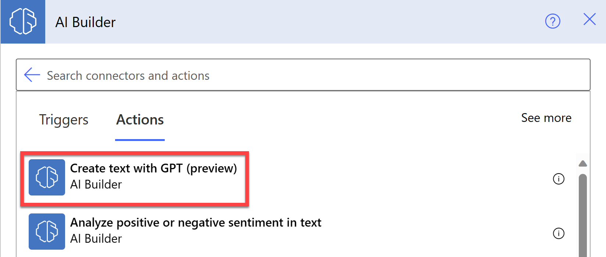
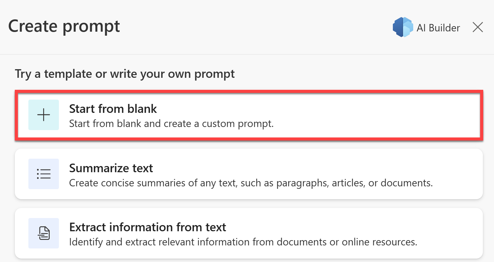
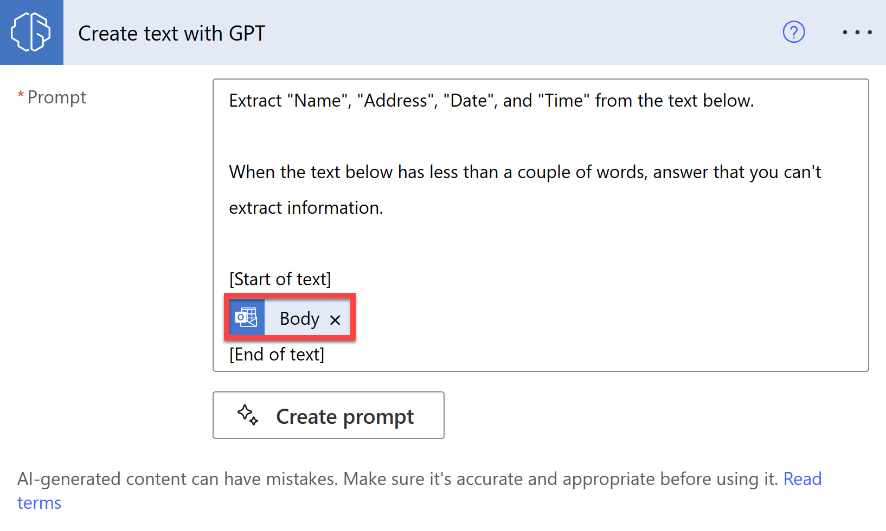
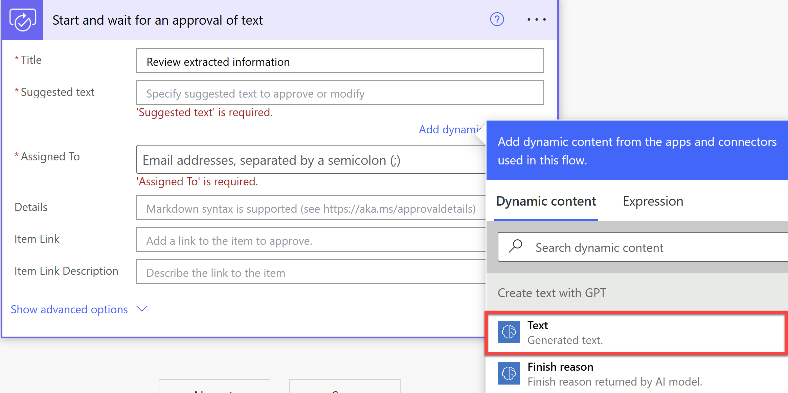

# MODULE 4: ADDING INTELLIGENCE WITH AI BUILDER AND GPT

This module will introduce the Generate Text with GPT capability in AI Builder. It will touch on how to write instructions and how to use the model in Power Automate. [To be continued]

## INTRODUCTION TO AI BUILDER (4 MINS)

TBD

## INTRODUCTION TO CREATE TEXT WITH GPT (4 MINS)

TBD

## EXERCISE – GENERATE TEXT WITH GPT IN AI BUILDER (15 MINS)

TBD - also explain scenario of people emailing to book a showing of a property and how we can use GPT to extract the relevant information from the email.

[Add note about GPT action not being supported by Power Automate Copilot so we're going to be using the traditional experience]

1. Sign into [Power Automate](https://make.powerautomate.com/).

2. On the left pane, select **Create** and then **Automated cloud flow**.

    

3. Give the flow the name: `Extract details for Real Estate Showing`.

4. In the **Search all triggers** box, type "when an email arrives" and select the **When an email arrives** trigger.

    

5. Select **Create**.

6. Select **Show advanced options** on the **When a new email arrives** trigger.

7. In the **Subject filter** box, type "[Query]".

    

    > **Note:** 
    >
    > This will ensure that the flow only runs when the subject of the email contains the word "Query" (for the purpose of this lab).
    >
    > In a real scenario, you may have a separate email address that handles customer queries so there would be no need to filter by subject.

8. Select **New step** and then select **AI Builder**.

    

9. Then select **Create text with GPT** in the list of actions.

    

10. Select **Create prompt** and then select **Start from blank**.

    

11. Paste the following text into the **Describe the text the model should create** box:

    ```
    Extract "Name", "Address", "Date", and "Time" from the text below.

    When the text below has less than a couple of words, answer that you can't extract information.

    [Start of text]
    Good day, 

    I hope this email finds you well. My name is Gomolemo Mohapi, and I am currently in the market for a new property. I came across your listing for the property located at 210 Pine Road, Portland, OR 97204, and am very interested in learning more about it.

    I would like to kindly request a viewing of this property on September 15th at 3:30 PM. I believe this time is within the normal hours for showings, but if there are any conflicts or alternate time suggestions, please let me know at your earliest convenience.
    [End of text]
    ```

    

    In this prompt, we're used the basic formula for creating a GPT prompt. We have the **Instruction**:

    `Extract "Name", "Address", "Date", and "Time" from the text below. When the text below has less than a couple of words, answer that you can't extract information.`

    And then we have the **Context**:

    `[Start of text] context [End of text]`

    The instruction tells the model what it should do. The context is the information the model needs to follow the instruction. In an automation task, the instruction is constant and the context is provided by dynamic content - which we will update in the next step.

12. Select **Test it out** to see if GPT extracts the correct information from the text.

    After a few seconds of preparing a response, it should be able to extract the relevant information from the example prompt:

    

13. Now select **Use prompt in flow**.

14. Delete the example email from the **Prompt** and replace it with the **Body** dynamic content of the email from the trigger

    

    Now whenever an email arrives, GPT will attempt to extract the relevant information from the email body.

    AI-generated content can be factually incorrect, inappropriate, or biased. We strongly recommend that you institute a practice of inserting [human oversight](https://learn.microsoft.com/en-us/ai-builder/azure-openai-textgen#human-oversight) in workflows that use AI-generated text before it's posted or used anywhere.

    Now you will be adding an approval step so a human can review the extracted information.

15. Select **New step** and then search for and select **Approvals**.

16. In the list of actions, select **Start and wait for an approval of text**.

17. In the **Title** box, type:

    `Review extracted information`

18. In the **Suggested text** box, add the **Text** dynamic content from the **Create text with GPT** action.

    

19. In the **Assigned to** box, type the email address you're using for this lab.

20. In the **Details** box, type:

    `Please review the extracted information and edit as necessary.`

    The action should look similar to the following: 

    

21. Now select **New step**, search for **Control**, and select **Condition**.

22. Select the **Choose a value** box and select **Outcome** from the Dynamic content pane.

23. Select **is equal to** for the condition and then type `Approve` for **Choose a value**.

    

24. In the **If yes** box, select **Add an action** and then search for **Teams** and select **Post a message in a chat or channel**.

25. Select **Flow bot** from the **Post as** dropdown menu, and then select **Chat with Flow bot** from the **Post in** dropdown menu.

    

26. In the **Recipient** box, type the email address you're using for this lab.

27. For the **Message** box, type:

    ```
    Please add the following Real Estate Showing Request.

    Client Email: 
    ```

28. Select **Add dynamic content** and then select **From** from the **When a new email arrives** action.

    

29. Beneath the Client Email line, select the **Accepted text** dynamic content from the **Start and wait for an approval of text** action.

    

    This will send a direct Teams message to you with the Client Email and the Accepted text from the approval action reminding you to create a record in the Real Estate Showings Power App.

    Of course, you can automate the record creation by converting the extracted entities into a JSON object and then using that to create a record in the Real Estate Showings Power App. However, that is beyond the scope of this lab.

    In the **If no** box, you can add a **Send an email** action to notify the sender that there wasn't enough information to book the showing. However, you can add that in your own time. 

30. For now, let's save the flow and test it out. Select **Save** and then **Test**.

31. Select **Manually** and then select **Test**.

32. Then from any email address, send an email to the email address you're using for this lab with the subject: `[Query] - New Booking Request` and the following body:

    ```
    Hello,

    I trust you're doing well. I'm John Doe and I'm actively searching for a new home. Your listing for the property at 789 Maple Avenue, Lexington, KY 40502 has caught my attention, and I'm eager to find out more.

    Could I arrange to see the property on September 29th at 1:45 PM? I think this falls within your usual showing times, but if that doesn't work for you or if you have other time options, I'd appreciate it if you could inform me as soon as possible.
    ```

33. Open Outlook and you should see the email that you've sent to yourself followed by the **Approval** request with the extracted information:

    

34. Select **Approve** and then open Teams. You should see a message from the Flow bot with the extracted information once arrpoved:

    

35. Going back to your Power Automate flow, you should see that flow ran successfully:

    