# Lab 03 - Create an AI Plugin using a Power Platform component for Generative Actions

AI Plugins can be used to extend Microsoft Copilot, or used within a custom copilot as a plugin action. You can create multiple types of AI plugins in Microsoft Copilot Studio:
- **Prompt plugins**, which use AI Builder and natural language understanding to target the specific scenarios and workflows within your business.
- **Flow plugins**, which use Power Automate flows to perform actions, and retrieve and work with data.
- **Connector plugins**, which use Power Platform connectors to access data from other systems, such as popular enterprise products like Salesforce, Zendesk, MailChimp, and GitHub.
- **OpenAI plugins**, which use connections to custom OpenAI models that you create.

In this lab, you will learn how to do the following:
* [3.1 Create a prompt plugin for generative actions](#31-create-a-prompt-plugin-for-generative-actions)

## 3.1 Create a prompt plugin for generative actions

In this part of the lab we’ll be creating a **prompt plugin** which is the **Generate content or extract insights** action from the AI Builder connector. The experience to create prompt plugins in Copilot Studio is the same as in Power Apps. Any plugins you create in either Copilot Studio or Power Apps go to the plugin registry and populate in both apps.

1.	Select **Copilots** in the left-hand side menu.

    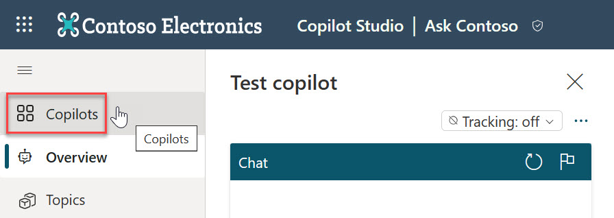

1.	Select **Extend (preview)** in the left-hand side menu and select **Add Power Platform components**.
    
    

1. Select **Content and insights**.

    

1.	A new browser tab will appear with the Power Apps maker portal. Select **Add a Power Platform component** as an AI plugin. 

    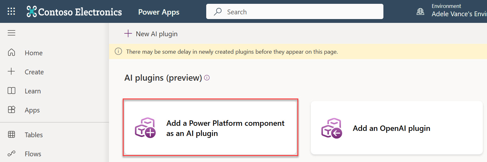

1.	Select **Generate content or extract insights**.

    

1.	The **Prompt** dialog will appear, where you’ll see the following

    - **Prompt settings** on the right hand side which contains         
        - **Prompt details** where the **Name** of the prompt is entered.
        - **Input** where the inputs for the prompt can be added or deleted.
    - **Prompt** on the top left hand side which is where you can enter your prompt. You can also start from a template.
    - **Prompt response** on the bottom left hand side which is where you can select **Test prompt** and the response will generate based on the prompt.

1.	Instead of creating a custom prompt from scratch or using a template, a prompt from the Power Platform Prompt Samples library can be used. In a new browser tab, navigate to [https://aka.ms/power-prompts](https://aka.ms/power-prompts) and filter to __“AI Builder”__ by ticking the checkbox on the left hand side.

    

1.	Select the **[“Learning Resources Prompt”](https://adoption.microsoft.com/en-us/sample-solution-gallery/sample/pnp-powerplatform-prompts-learning-resources/)** and copy the prompt.

    

1.	Go back to the Power Apps maker portal with the Prompt dialog. Paste the copied prompt value in the **Prompt** box on the top left hand side.

    

1.	Expand the **Prompt details** section and enter name for the prompt such as `Learning Resources`

    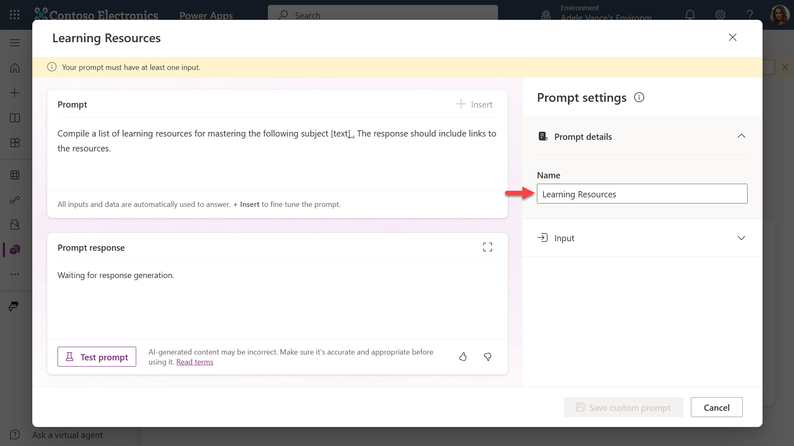

1.	Expand the **Input section** and select **+ Add input**.

    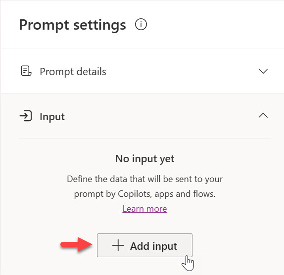

1.	Enter a name for the input such as `Subject` and enter sample data such as, `Building with Power Apps`.

    

1.	Next, the input needs to be inserted into the prompt. In the Prompt, delete **[text]** and select **+ Insert** and select **subject**. The input of subject as now been added to the prompt as an input.

    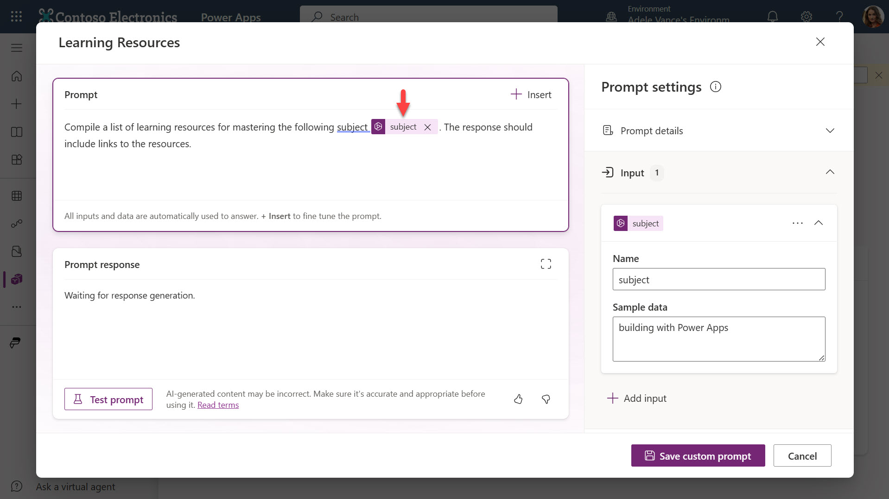

1.	Test the prompt before saving the custom prompt. Select **Test prompt** on the bottom left hand side. A response to the prompt regarding the value provided in the sample data of the subject input is returned. Links are provided for each of the learning resources generated by the AI-powered prompt. You can also maximize the prompt response box to enlarge the prompt response dialog.

    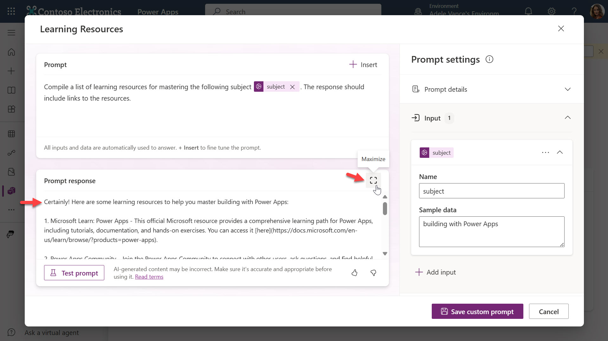

1.	Select **Save custom prompt**. The prompt will be created as an AI plugin and it will appear after some time on the list of AI plugins.

    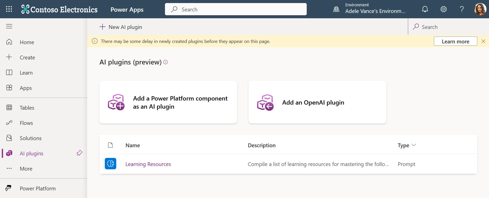

1.	Navigate back to Copilot Studio and refresh your browser tab. The AI plugin will now be visible in the list.

    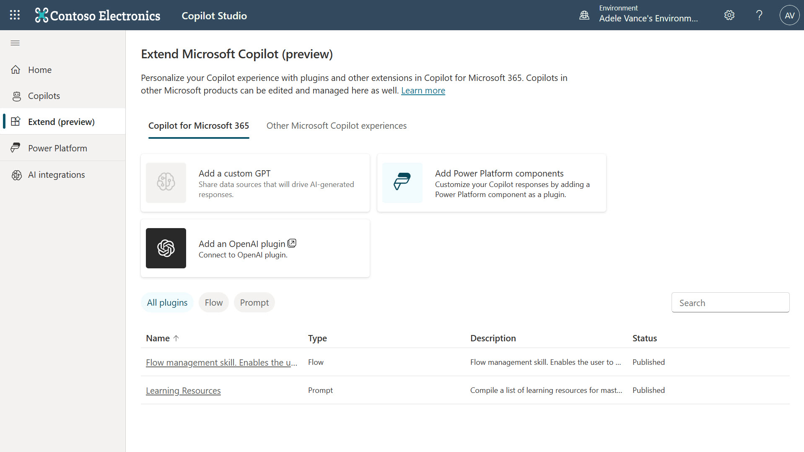

1.	The AI plugin can now be added to the copilot created earlier. Select **Copilots** on the left hand side menu and select your Copilot.

    Select Actions on the left hand side menu and select + Create.

    

1.	In the search field enter the name of your custom prompt from Step 9 and select **Search**.
    
    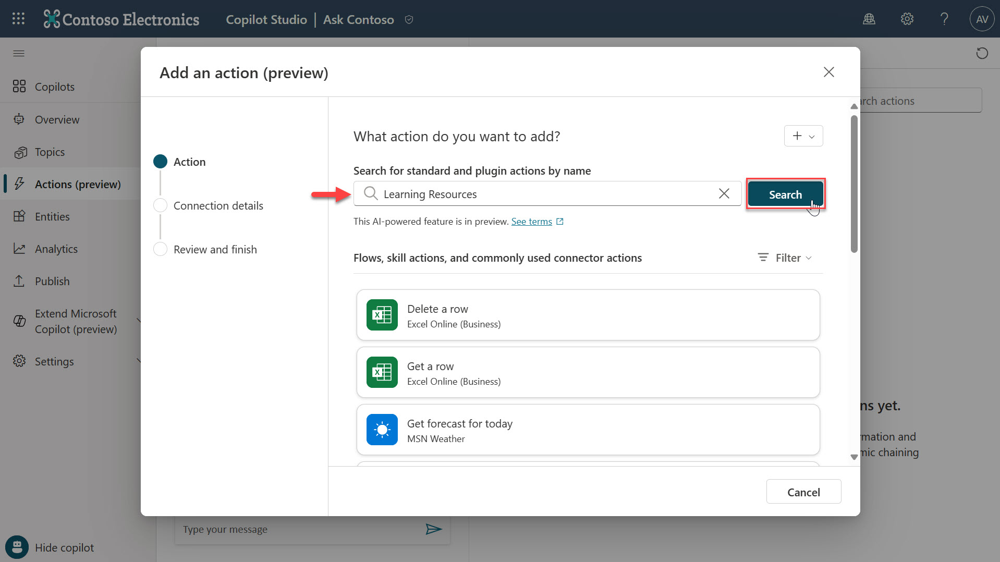

1.	 Scroll down until you find your custom prompt. It’ll have the Dataverse icon. Select your custom prompt.
    

1.	In the next step, the inputs and outputs can be configured. Since the custom prompt already has the input defined and the output is the response from the AI Builder action - Generate content or extract insights, these need to be added to the plugin action. For the **input**, select **Add** and **select subject**.

    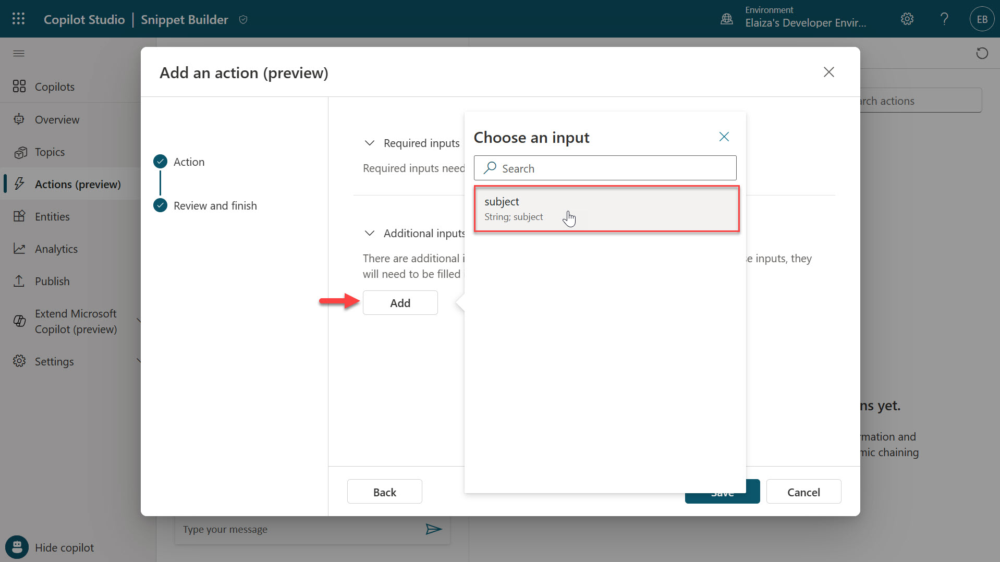

1.	The description is important to provide as this helps the AI determine how to fill this input. Enter a description for the subject such as `subject of the learning resource`. Select **Back**.
    
    

1.	Next add the output, select **Add** and select **Text**.

    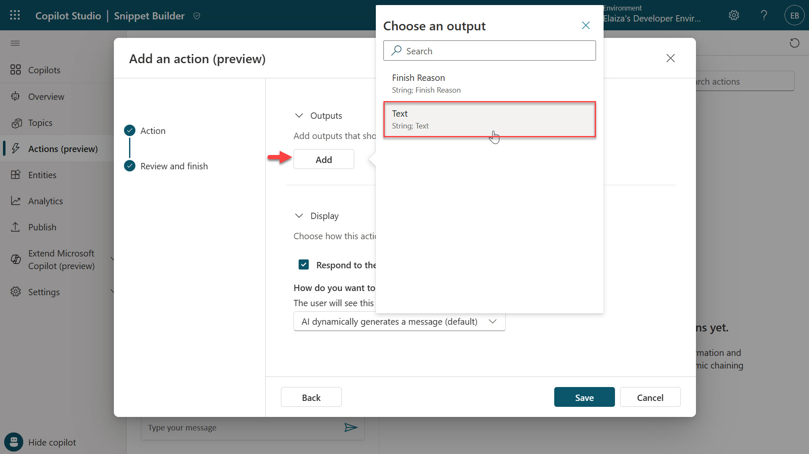

1.	Enter a a display name value such as `text` and enter a description for the text output such as `The AI generated response`.

    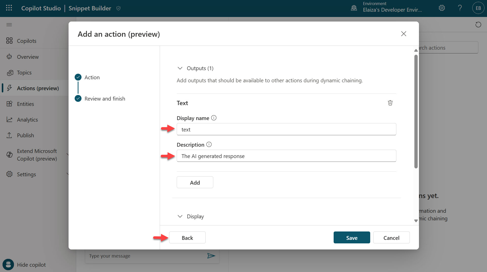

1.	Scroll down and there are two options which can be left as-is. 
    - **Respond to the user after running this action** is ticked by default. 
    - **How do you want to display information to the user?** allows you to modify how the result should be returned. By default the first one in the following list is selected,
        - AI dynamically generates a message (default)
        - AI dynamically generates an adaptive card from an example you create – this is currently disabled and will be available in the future
        - You create a message
        - You create an adaptive card
    
    Select Back.

    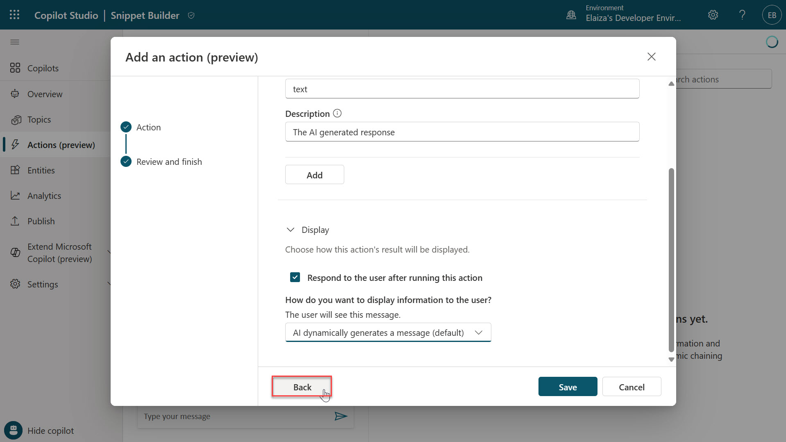

1.	Select **Finish**. The custom prompt has now been created as a plugin action in Copilot Studio.

    

1.	To test the plugin action, the setting of Dynamic chaining with generative actions (preview) needs to be enabled. Select **Go to Generative AI**.

    

1.	Scroll down and enable **Dynamic chaining with generative actions (preview)** by selecting the toggle. Select **Save**.
    
    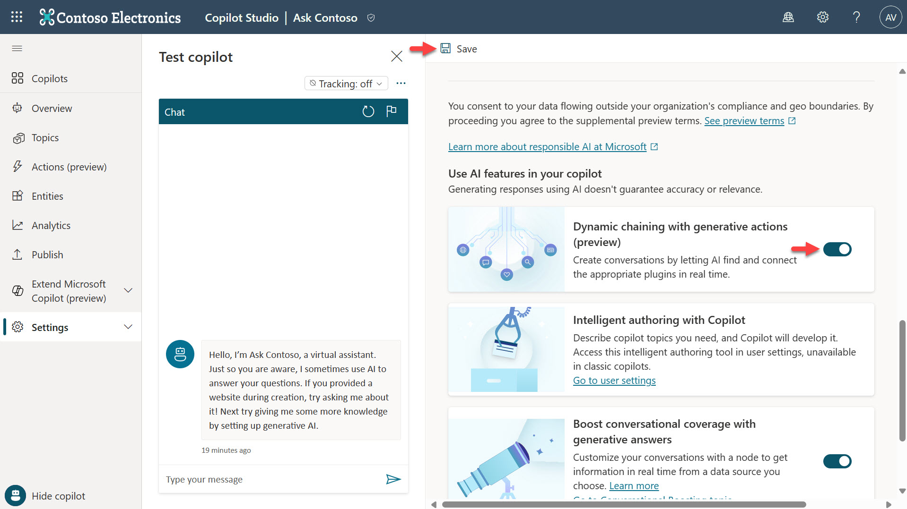

1.	Select the **Sparkle icon** to view tracing mode.

    

1.	Select the **refresh** icon on the chat to test the copilot.

    

1.	Enter the following prompt, 

    ```
    Can you please provide me with learning resources for building with Power Apps
    ```

    In the tracing mode view, the plugin action for the custom prompt will be triggered and the input value of subject is populated with Power Apps as AI recognized this is the subject in the prompt.

    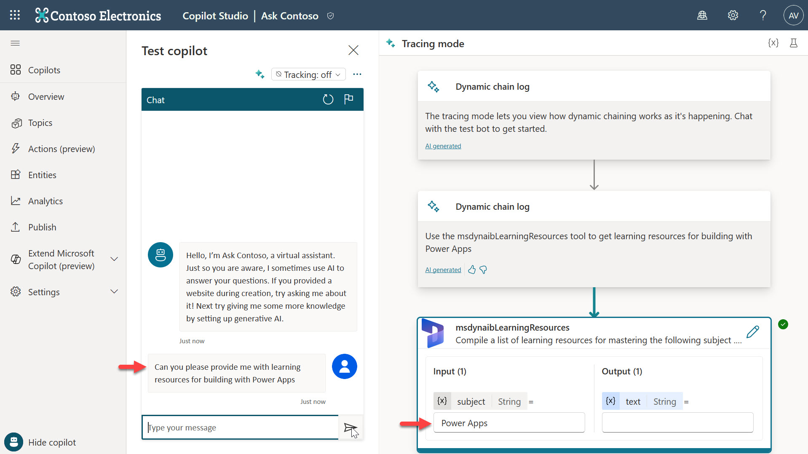

1.	After a few seconds, an answer is returned from the AI Builder action of the custom prompt in plain natural language and is populated in the text output as seen in tracing mode. 

    

## Next lab

Congratulations! 🙌🏻 You’ve now learnt how to create an AI Plugin by creating a custom prompt with one of the Power Platform Prompt samples, and how to create this as a plugin action in Copilot Studio.

This is the end of Lab 03 - Create an AI Plugin using a Power Platform component for Generative Actions, select the link below to move to the next lab.

[⏭️ Move to Lab 04 - Create a custom topic with a plugin action for Generative Action](../lab-04/README.md)

