# Lab 04 - Create a custom topic with a plugin action for Generative Actions

A prompt plugin can also be executed inside of a Topic to create a controlled user experience and add further logic and/or processing of the copilot.  The prompt plugin can be added as a plugin action inside the authoring canvas.

In this lab, you will learn how to do the following:
* [4.1	Adding the prompt plugin as an action to a Topic](#41-adding-the-prompt-plugin-as-an-action-to-a-topic)

## 4.1	Adding the prompt plugin as an action to a Topic

In this part of the lab you’ll learn how to add the prompt plugin created earlier to a Topic.

1.	Select **Topics** in the left hand side menu. Click on the **X** icon to close **Test copilot** to increase the width of the authoring canvas and select **+ Create**. Select **Topic** and select **From blank**.

    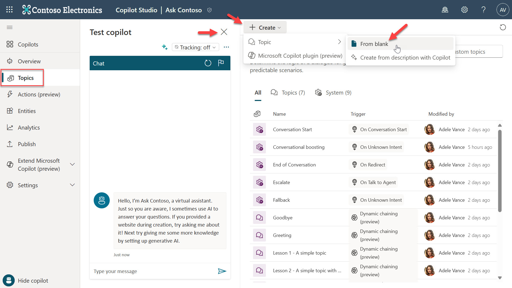

1.	Enter a name for the Topic and in the description of the Trigger, enter 5 trigger phrases. 

    Example: 

    ```
    Compile a list of learning resources for mastering the subject provided by the user including links to the resources, provide a list of learning resources for the subject entered by the user including links to the resources, compile a list of learning resources including links to the resources for mastering the subject entered by the user, generate a list of learning resources for mastering the subject entered by the user including links to the resources, create a list of learning resources for mastering the subject provided by the user including links to the resources
    ```  

    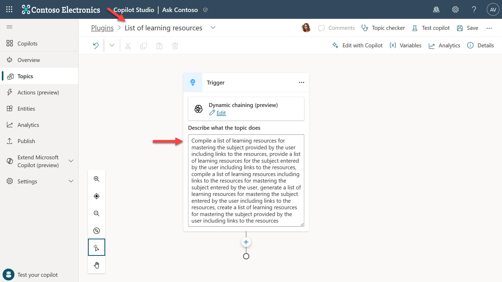

1.	Select **Save** on the top right of the authoring canvas to save the Topic.

    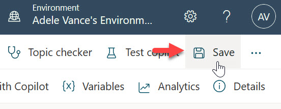

1.	Next, we’ll display a message to let the user know that copilot will go ahead and perform an action. Select the **+** icon in the authoring canvas to add a new node. Select **Send a message**.

    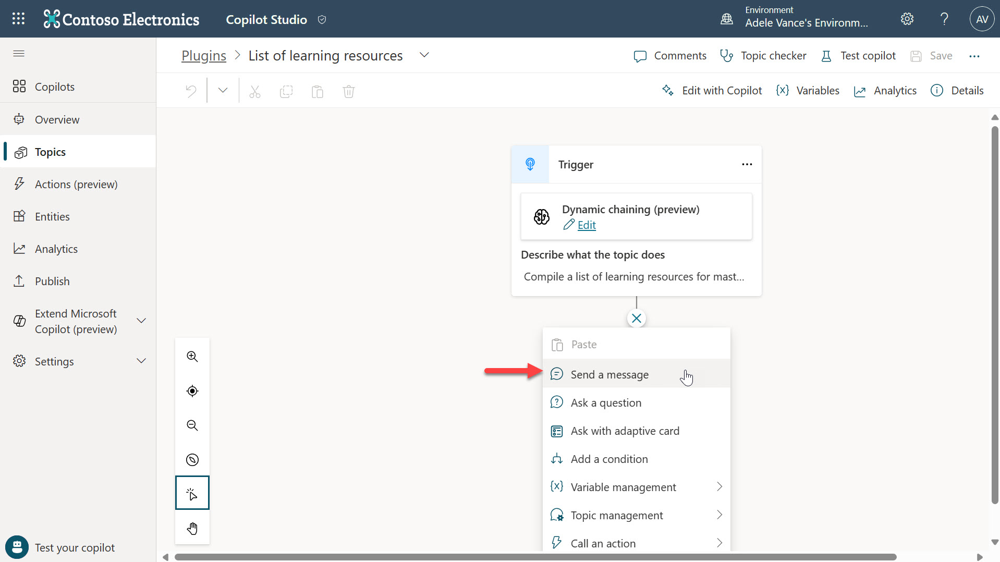

1.	Enter a message such as, **Let me compile a list of learning resources for you, one moment please.**

    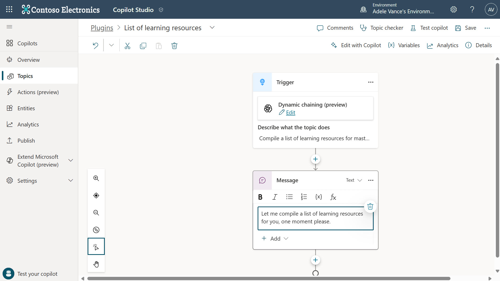

1.	Select the **+** icon in the authoring canvas to add a new node. This time select **Call an action** and select the **Plugin (preview)** tab. The AI plugin of the custom prompt created earlier will be displayed, select it.

    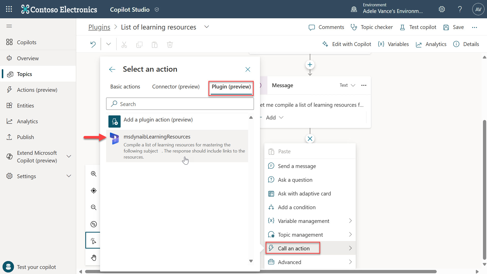

1.	The plugin action will be added to the authoring canvas with the outputs already configured. The input will need to be added. Select **+ Set value** and **select subject**.

    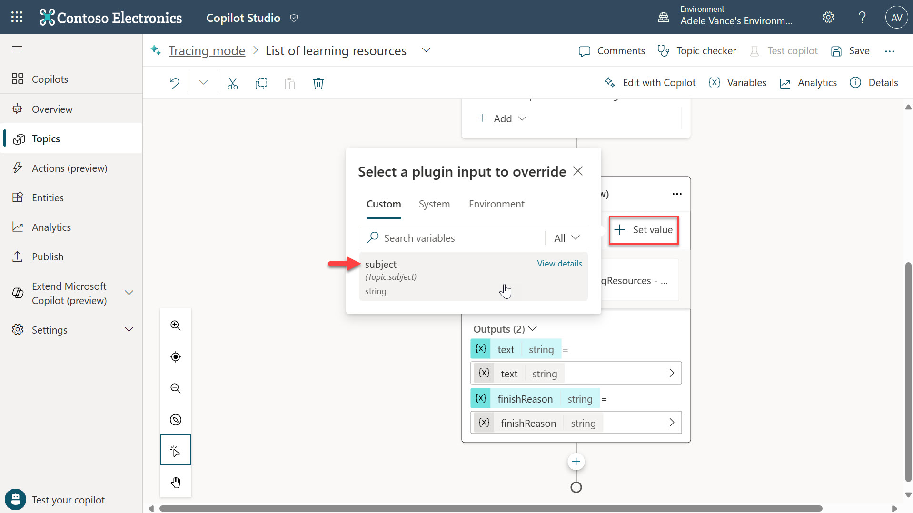

1.	Select the **>** icon and select **Activity.Text** as the input value for the plugin action to use the user’s entire response and identify the subject value.

    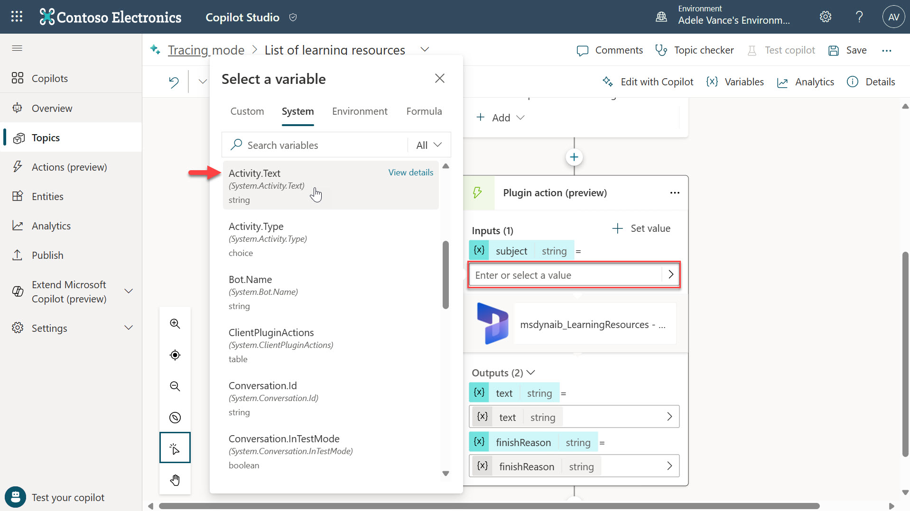

1.	Select the **+** icon in the authoring canvas to add a new node. This time select **Send a message**

    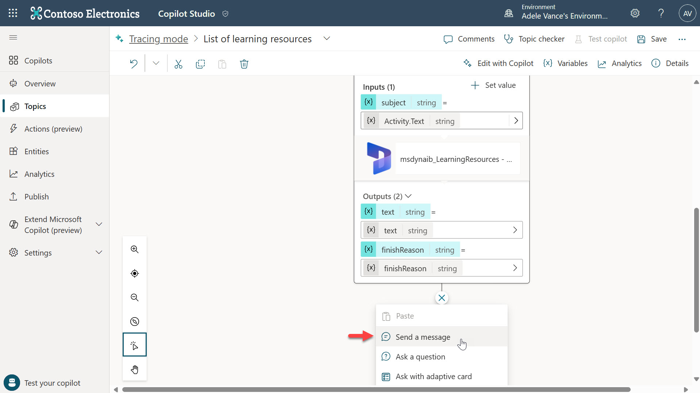

1.	To insert the output value which is the prompt response of the plugin action, use a Power Fx expression. Select the Power Fx icon, enter Topic.Output.text and select Insert.
    
    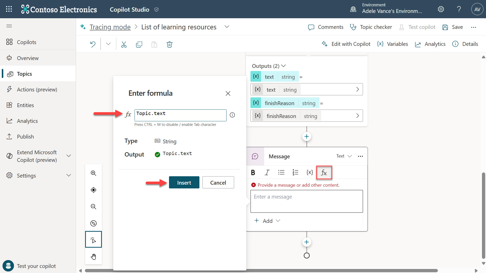

1.	The Send a message node will now display the output from the plugin action.	Select **Save** on the top right of the authoring canvas to save the updated Topic.

    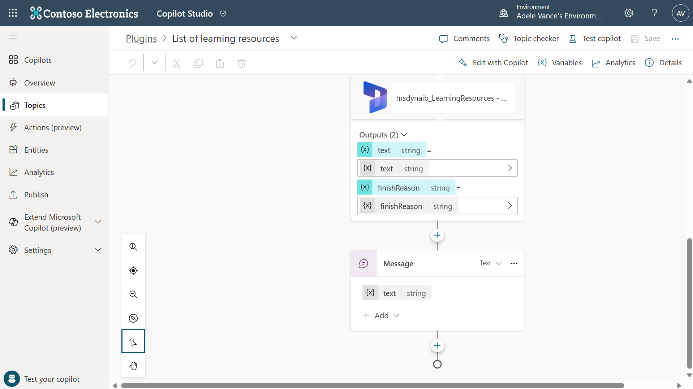

1.	The plugin action created earlier for the prompt plugin needs to be modified, the response to the user needs to be disabled since the response will be returned from the Topic. In the Outputs tab untick the Respond to the user after running this action checkbox. Select the **Save** icon on the top right. 

    

1.	Now let’s test the updated copilot by triggering the recently created Topic. Navigate to **Topics** and select the Topic created earlier.

    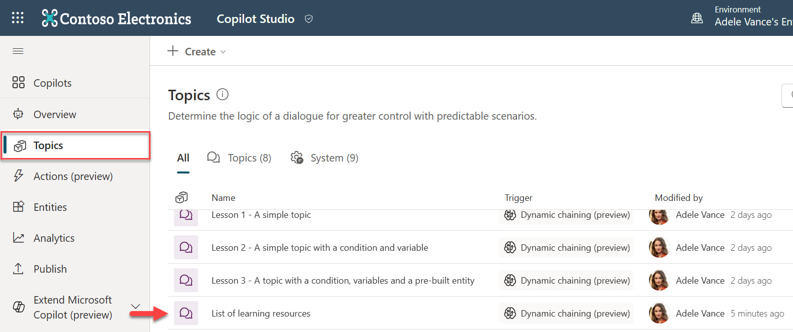

1.	Select **Test copilot** on the top right.

    

1. Enter a prompt such as, **Can you please provide me with learning resources for building with Power Apps**

    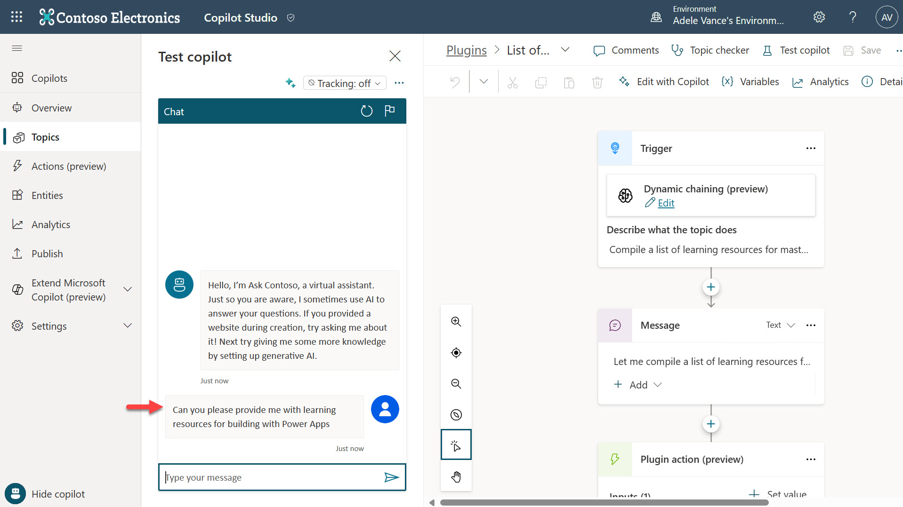

1.	The Topic will be triggered with a message sent to the user about compiling the list of learning resources, followed by the prompt response as copilot executed the AI Plugin action. In the tracing mode view, you’ll see that the Topic succeeded with the green tick icon displayed.

    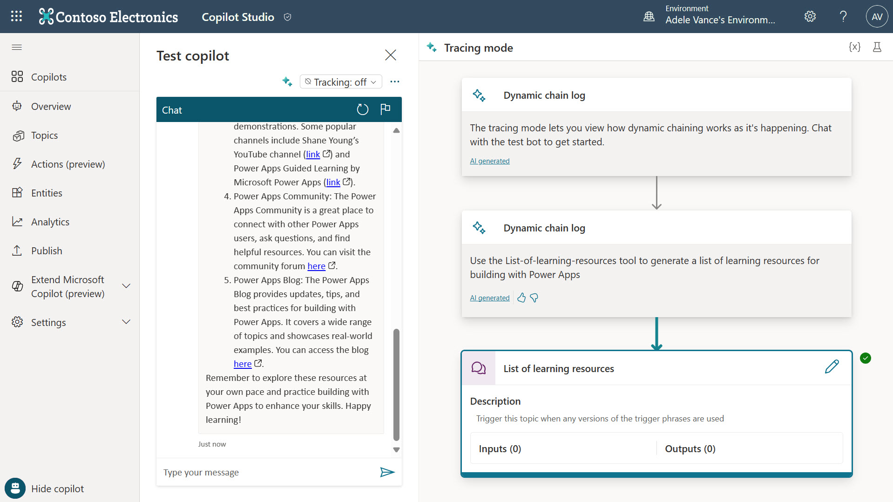

## Next lab

Congratulations! 🥳 You created a custom topic and added the prompt plugin created in [lab 02](../lab-02/README.md) as a plugin action.

This is the end of Lab 04 - Create a custom topic with a plugin action for Generative Action, select the link below to move to the next lab.

[⏭️ Move to Lab 05 - Automation in copilot with Power Automate cloud flows](../lab-05/README.md)
