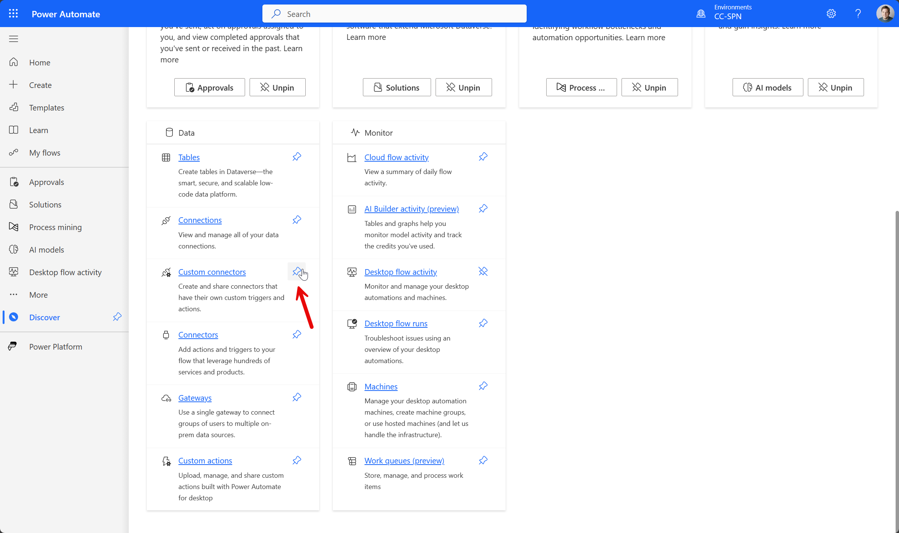
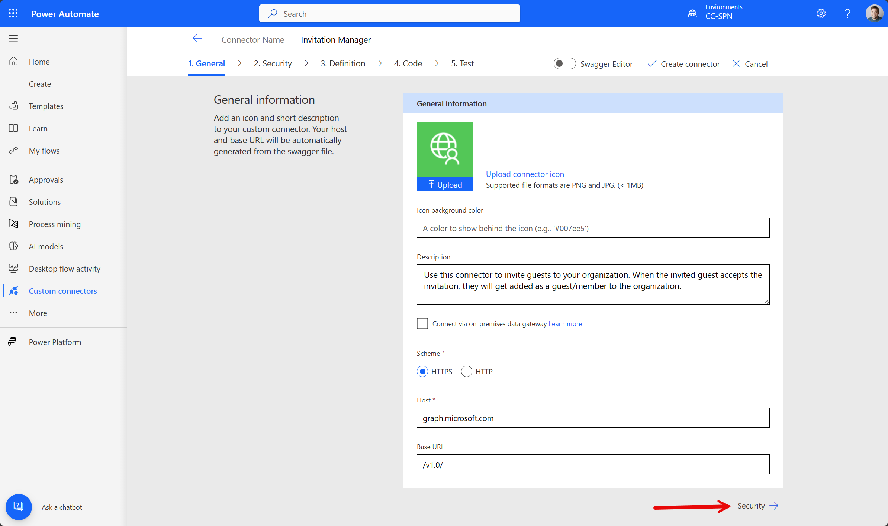

# Lab: Use service principal auth for custom connectors

In this lab, you will learn how to use service principal auth for custom connectors. The Microsoft Graph API and in particularly the Invitation Manager is used for this lab. During this lab you will learn how to create a connector that contains only one action. This lab is focused on creating service principal support for custom connectors, so it's not about having a big connector with lots of actions.

## Learn about the API

When building a connector, the first thing that you need to do is read the docs. In this case, we are going to build a connector for the [Microsoft Graph API](https://aka.ms/graph). To be more specific, we are going to build a connector for the Invitation Manager. The Invitation Manager is an operation in the Microsoft Graph API that helps organizations manage their guest users. In the Microsoft ecosystem, it is possible to invite guest users to your organization and share certain assets with them. This could be a SharePoint site, OneDrive for Business documents or folders, but we can also share Power Apps or even give them the ability to make within the Power Platform.

To learn more about the Invitation Manager, go to the [API reference](https://aka.ms/invitationmanager) on the Microsoft Graph learn website. On this page, you can read more about what the operation does, what the methods, properties and relationships are. In most cases, there also is a JSON representation of the resource (like in this case, the invitation resource).

>> !IMPORTANT
>> Learning about the API is one of the most important steps when you are building a connector. Knowing what the API does will benefit you in the rest of the process of building a connector massively.

## Create the connector

In this lab, we will start creating a connector from blank. This is something you can do in the maker portal.

1. Go to the Power Automate maker portal via [https:/make.powerautomate.com](https:/make.powerautomate.com)
  
1. Select **More** in the left navigation
1. Select **Discover all** in the pop out
  
1. Scroll down the page, and in the **Data** section, make sure to click the **pin** next to **Custom connectors**. This will pin the **Custom connectors** section to the left navigation and this will be useful in this lab
  
1. Select **Custom connectors** in the left navigation
1. In the custom connectors section, select **New custom connector** in the top-right and select **Create from blank**
1. Enter **Invitation Manager** as the name and select the blue **Continue** button
1. This will open the custom connector UI. Here we will do most of our work. Add the following description:

    ```text
    Use this connector to invite guests to your organization. When the invited guest accepts the invitation, they will get added as a guest/member to the organization.
    ```

1. Next, make sure to add `graph.microsoft.com` as the host
1. Add `/v1.0/` as the Base URL
1. Select **Security** at the bottom to move to the security section

    

1.
