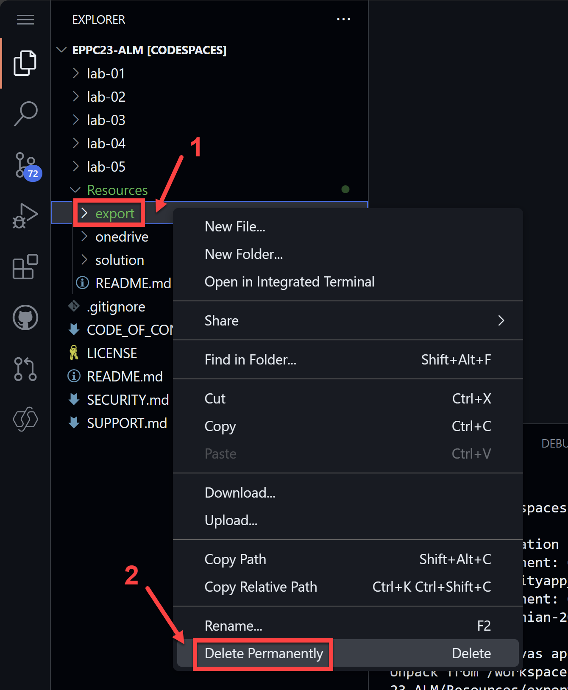
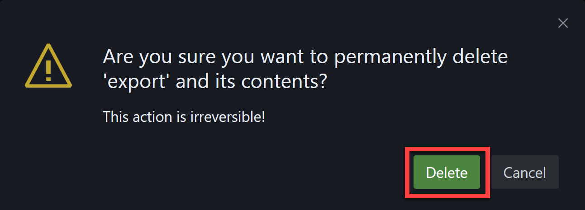
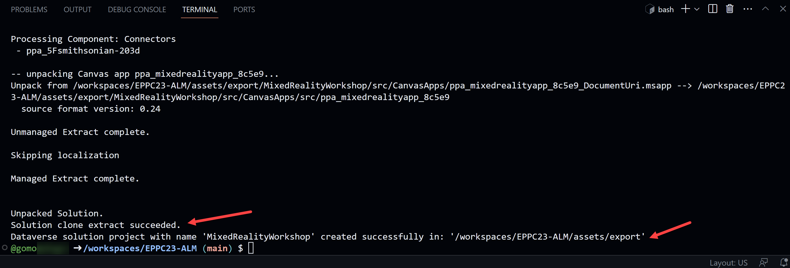

# Lab 02 - Work with solutions

In this lab you will learn the following:

* Uploading assets to OneDrive
* Import a solution zip file
* Export a solution from an environment
* Unpack a solution
* Inspect the solution folders
* Clone a solution

## Task 1: Uploading assets to OneDrive

In this task, you will be uploading a couple of assets to your OneDrive. The solution we will be working with later uses **OneDrive for Business** as a connector to retrieve files and images and their respective information directly from OneDrive to be used in a Canvas App.

1. In the browser, navigate to [OneDrive](https://portal.office.com/onedrive) and sign in with your credentials for this workshop

    Since this is most probably your first time signing into OneDrive with these credentials, you will see a welcome screen.

2. Click **Your OneDrive is ready**

    

3. Once inside OneDrive, select **My files** on the left navigation bar.

    Now you will be downloading the assets needed to upload to your OneDrive.

4. In a new browser tab, navigate to the [Coral Collection.zip](../assets/OneDrive%20folder/Coral%20Collection.zip) folder in this repository

5. Download the zip file to your computer

    TODO: Add screenshot of download and update download instructions when repo has been moved to official workshop repo

6. Navigate to the folder where you downloaded the zip file and extract the contents. You should now have a folder called **Coral Collection**.

7. Go back to your OneDrive tab and click **Upload** and select **Folder**. 

8. Navigate to the **Coral Collection** folder and select it.

9. Click **Upload** to upload the folder to your OneDrive.

    This may take a few minutes depending on your internet connection. Once the upload is complete, you will see the **Coral Collection** folder in your OneDrive. Open the folder to find 2 additional folders; _Models_ and _Photos_, as well as a CoralCollection.xlsx file.

    

## Task 2: Import a solution zip file

In this task you will import a solution zip file into your Developer Environment. The solution that you will be working with throughout this workshop is from our [Mixed Reality Workshop](https://github.com/microsoft/PowerPlatformAdvocates/blob/main/Workshops/MR/README.md). 

In your codespace terminal, type the following command to import the solution zip file into your **Dev** environment. 

```bash
pac solution import --path assets/solution/MR_Solution.zip
```

Once the import is complete, you will see a message in the terminal saying ```Solution Imported successfully.```


## Task 3: Export a solution from an environment

For this task, we will be exporting the solution that we just imported into our **Dev** environment.

In your codespace terminal, type the following command to export the solution zip file from your **Dev** environment. 

```bash
pac solution export --path Resources/export/Exported_MR_solution.zip --name MixedRealityWorkshop
```

Once the export is complete, you will see a message in the terminal saying ```Solution export succeeded.```


## Task 4: Unpack the exported solution

Now, we will be unpacking the solution zip file that we just exported from our **Dev** environment.

In your codespace terminal, type the following command to unpack the solution zip file from your **Dev** environment. 

```bash
pac solution unpack --zipfile Resources/export/Exported_MR_solution.zip --folder Resources/export/Unpacked_MR_solution --processCanvasApps
```

Once the unpack is complete, you will see a message in the terminal saying ```Unpacked Solution```


## Task 5: Commit changes

TODO

## Task 6: Clone a solution from an environment

For this task, we will be using the ```pac solution clone``` command to clone the solution inside of the **Dev** environment. This command will do exactly what we did in the Task 3 and 4 so we need to delete the export folder that we have created.

1. In your codespace Explorer, locate the ```Resources/export``` folder and delete it by right clicking on the folder and selecting **Delete Permanently**.

    

2. When the confirmation dialog appears, click **Delete**.

    

Now that we have deleted the export folder, we can clone the solution from the **Dev** environment.

In your codespace terminal, type the following command to clone the solution from your **Dev** environment.

```bash
pac solution clone --name MixedRealityWorkshop --processCanvasApps
```

Once the clone is complete, you will see a message in the terminal saying:

 ```
 Solution clone extract succeeded.
 Dataverse solution project with name 'MixedRealityWorkshop' created successfully in: '/workspaces/EPPC23-alm'
 ```



## Task 7: Commit Changes

TODO

## Task 8: Review export/unpack folder vs clone folder

TODO

## Task 9: Review solution on the Maker Portal

TODO

## Next lab

This is the end of lab 02, select the link below to move to the next lab.

[⏭️ Move to lab 03](../lab-03/README.md)
