# Lab 02 - Working with solutions

In this lab, you will go through the following tasks:

* Uploading assets to OneDrive
* Importing a solution zip file
* Exporting a solution from a Power Platform environment
* Unpacking the exported solution
* Cloning a solution
* Inspecting the solution folders
* Reviewing the solution in the Power Apps Maker Portal

## Task 1: Uploading assets to OneDrive

In this task, you will be uploading a couple of assets to your OneDrive. The solution we will be working with later uses **OneDrive for Business** as a connector to retrieve files and images and their respective information directly from OneDrive to be used in a Canvas App.

1. In a new tab, navigate to [OneDrive](https://portal.office.com/onedrive) and sign in with your credentials for this workshop

    Since this is most probably your first time signing into OneDrive with these credentials, you will see a welcome screen.

2. Click **Your OneDrive is ready**

    

3. Once inside OneDrive, select **My files** on the left navigation bar.

    **My files** is where you'll be uploading the OneDrive content to. Let's go ahead and download these assets now.

4. In a new browser tab, navigate to the [Coral Collection.zip](../assets/onedrive/Coral%20Collection.zip) folder in this repository

5. Download the zip file to your computer by clicking on the "**...**" button towards the right-hand side of the screen and then select **Download**

    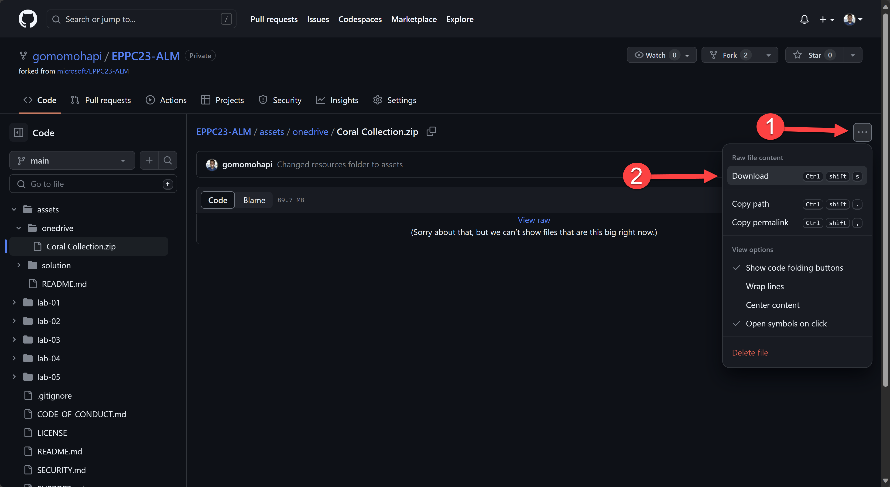

6. Navigate to the folder where you downloaded the zip file and extract the content. You should now have a folder called **Coral Collection**.

7. Go back to your OneDrive tab and click **Upload** and select **Folder**. 

    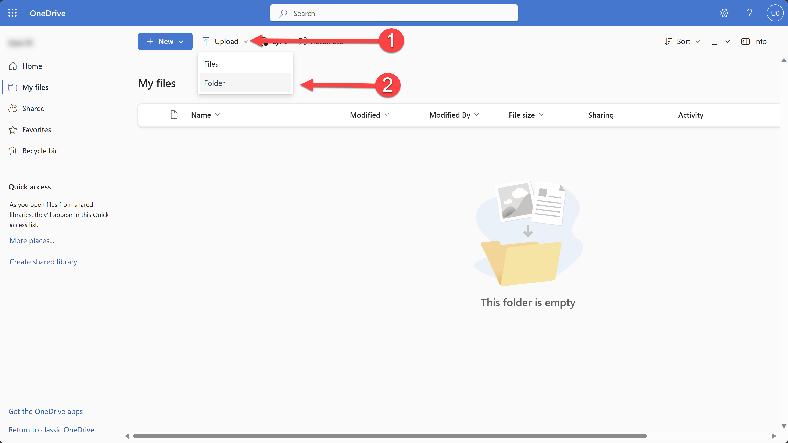

8. Navigate to the **Coral Collection** folder and select it.

9. Click **Upload** at the bottom of your screen to upload the folder to your OneDrive.

    This may take a few seconds. Once the upload is complete, you will see the **Coral Collection** folder in your OneDrive. Open the folder to find 2 additional folders; _Models_ and _Photos_, as well as a CoralCollection.xlsx file.

    

## Task 2: Import a solution zip file

In this task you will import a solution zip file into your Developer Environment. The solution that you will be working with throughout this workshop is from our [Mixed Reality Workshop](https://github.com/microsoft/PowerPlatformAdvocates/blob/main/Workshops/MR/README.md).

Go back to your codespace. If you need to restart it, then go ahead and do that. 

Let's open up a new Terminal window. Click on the Burger menu icon in the top left corner and then hover over **Terminal** and then click **New Terminal**

In your codespace terminal, type the following command to import the solution zip file into your **Dev** environment.

```bash
pac solution import --path assets/solution/MR_Solution.zip
```

Once the import is complete, you will see a message in the terminal saying ```Solution Imported successfully.```


> **Command Explanation:** 
>
> ```pac solution import``` is the command that we are using to import a solution zip file into our Power Platform Dataverse environment.
>
> ```--path assets/solution/MR_Solution.zip``` is the path to the solution zip file that we want to import. You can find the solution zip file in the **[assets/solution](../assets/solution/)** folder in this repository.

## Task 3: Export a solution from an environment

For this task, we will be exporting the solution that we just imported into our **Dev** environment.

In your codespace terminal, type the following command to export the solution zip file from your **Dev** environment. 

```bash
pac solution export --path assets/export/Exported_MR_solution.zip --name MixedRealityWorkshop
```

Once the export is complete, you will see a message in the terminal saying ```Solution export succeeded.```


> **Command Explanation:** 
>
> ```pac solution export``` is the command that we use to export a solution from our Power Platform Dataverse environment as a zip file into the GitHub Repository.
>
> ```--path assets/export/Exported_MR_solution.zip``` is the path where the exported solution zip file will be saved.
>
> ```--name MixedRealityWorkshop``` is the name of the solution that we want to export. This is the same name as the solution that we imported in the previous task.

In your codespace Explorer, navigate to the assets/export folder. You should see a new file called **Exported_MR_solution.zip**. This was created from the command you have just executed. 

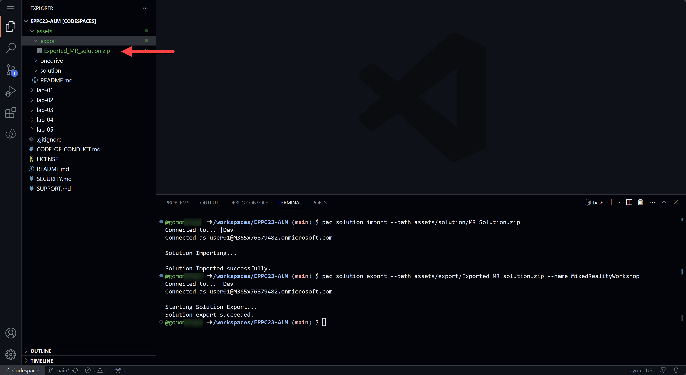

## Task 4: Unpack the exported solution

Now, we will be unpacking the solution zip file that we just exported from our **Dev** environment.

In your codespace terminal, type the following command to unpack the solution zip file from your **Dev** environment. 

```bash
pac solution unpack --zipfile assets/export/Exported_MR_solution.zip --folder assets/export/Unpacked_MR_solution
```

Once the unpack is complete, you will see a message in the terminal saying ```Unpacked Solution```

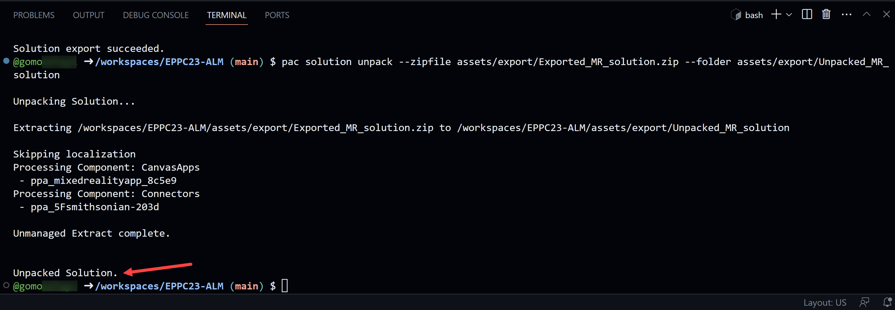

> **Command Explanation:** 
>
> ```pac solution unpack``` extracts the solution components from a solution zip file into a folder.
>
> ```--zipfile assets/export/Exported_MR_solution.zip``` is a required parameter that specifies the path to the solution zip file that we want to unpack.
>
> ```--folder assets/export/Unpacked_MR_solution``` represents the path to the root folder where the solution components will be extracted to.

In your codespace Explorer, navigate to the assets/export folder. You should see a new folder called **Unpacked_MR_solution**. This was created from the ```pac solution unpack``` command you have just executed. 

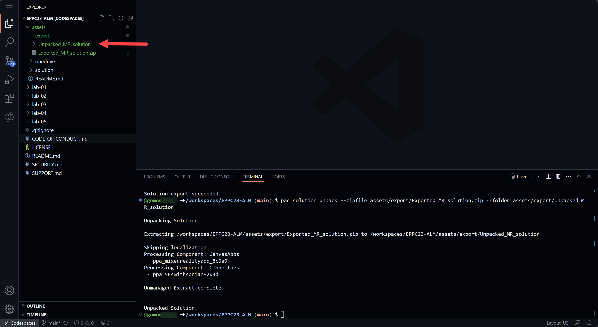

## Task 5: Clone a solution from an environment

For this task, we will be using the ```pac solution clone``` command to clone the solution inside of the **Dev** environment. This command will do exactly what we did in Task 3 and 4 but in one command instead of two.

In your codespace terminal, type the following command to clone the solution from your **Dev** environment.

```bash
pac solution clone --name MixedRealityWorkshop --outputDirectory assets/export --processCanvasApps
```

Once the clone is complete, you will see a message in the terminal saying:

 ```
 Solution clone extract succeeded.
 Dataverse solution project with name 'MixedRealityWorkshop' created successfully in: '/workspaces/EPPC23-ALM/assets/export'
 ```


> **Command Explanation:** 
>
> ```pac solution clone``` creates a clone (copy) of a solution from a Power Platform Dataverse environment into a folder. Previously, you used export and unpack to achieve the same result.
>
> ```--name MixedRealityWorkshop``` is the name of the solution that we want to clone. 
>
> ```--outputDirectory assets/export```is the path to the root folder where the solution components will be cloned to.
>
> ```--processCanvasApps``` is a flag that tells the command to unpack a canvas app so you can see it's source files. Including but not limited to any assets, connections, data sources, etc. This was missing from the unpack command

## Task 6: Commit Changes

Now that we've added additional folders and files, let's go ahead and commit these changes to our forked repository. To commit is to save the changes that you have made to your repository.

1. In the left navigation bar, click on the **Source Control** icon

    

2. In the **Source Control** panel, you will see a list of files that have been changed or have been added. 

3. Type in a commit message in the **Message** box. For example, ```Added exported, unpacked and cloned solution files```. A commit message is a short description of the changes that you have made to your repository    

4. Click the **✓ Commit** button to commit the changes

    

5. A popup dialog may appear alerting you of the fact that there are no staged changes. It may also ask you to stage all changes and commit them directly. Select **Yes**

    

    Now because we're using a codespace, the commit will save the changes inside of this codespace. We need to sync changes to our forked repository as well.

6. Click **Sync Changes** in the Source Control panel

    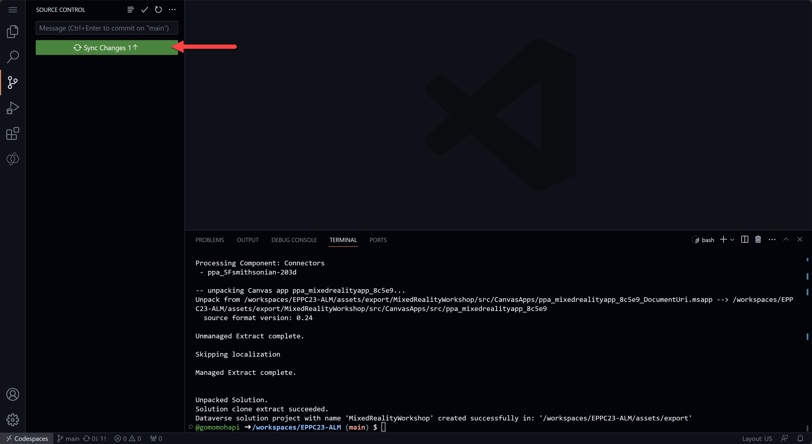

    This will push the changes to your forked repository.

7. And then on the popup dialog, click **Ok** to confirm that this action will pull and push commits from and to "origin/main"

    Now our codespace is synced with our forked repository.

## Task 7: Review export/unpack folder vs clone folder

We have created additional folders and files in our repository all with subtle but important differences. Let's review the differences between the folders that were created from the export/unpack commands and the clone command.

1. In the codespace, navigate back to the **Explorer** panel and expand the **assets/export** folder. 

    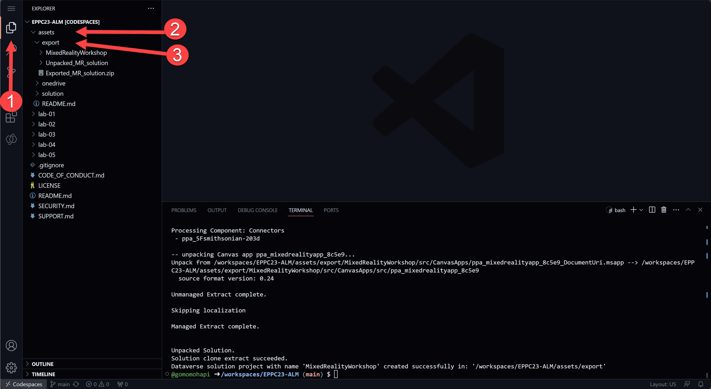

There are two main folders here. The **Unpacked_MR_solution** folder which was created from the ```pac solution export``` and ```pac solution unpack``` commands. We also have the **MixedRealityWorkshop** folder which was created from the ```pac solution clone``` command.

| **MixedRealityWorkshop** | **Unpacked_MR_solution** | Explanation |
|--------------|-----------|------------|
| 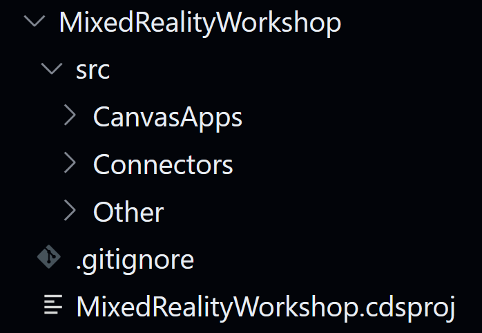 | 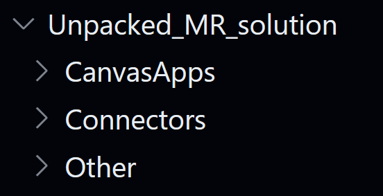 | TODO Daniel  |
| 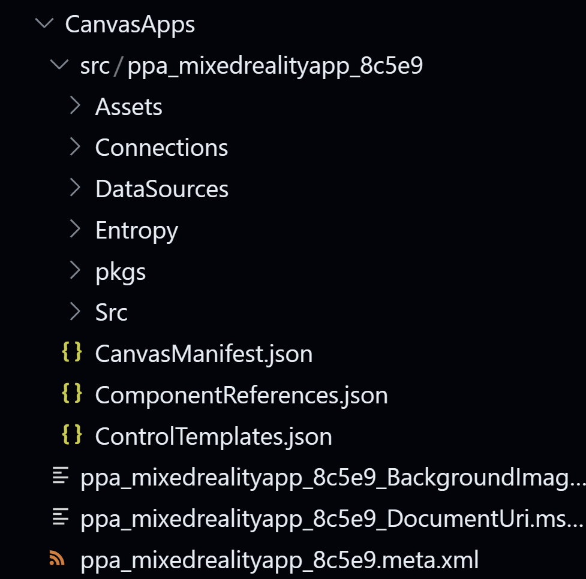 |   | TODO Daniel |
|  |   | TODO Daniel |
|  |   | TODO Daniel |

TODO Daniel: Closing statement

## Task 8: Review solution on the Maker Portal

Now that we know about the ins and outs of a solution, including how to interact with them through the Power Platform CLI - let's go ahead and review the solution in it's entirety on the Power Platform Maker Portal and check that everything is working as expected.

1. In a new browser tab, navigate to the [Power Platform Maker Portal](https://make.powerapps.com/)

2. Log in with your workshop credentials, if you have to. 

3. Make sure that you're in the correct environment at the top right-hand side of the portal - it should be ```Dev```. If not then click on the environment picker and change it to the correct one.

    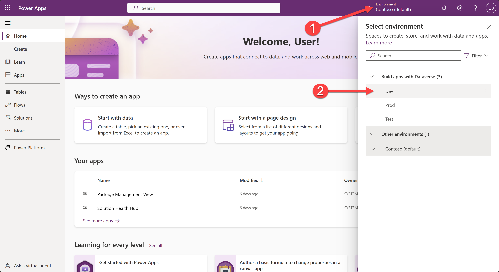

4. Click on **Solutions** in the left navigation bar

    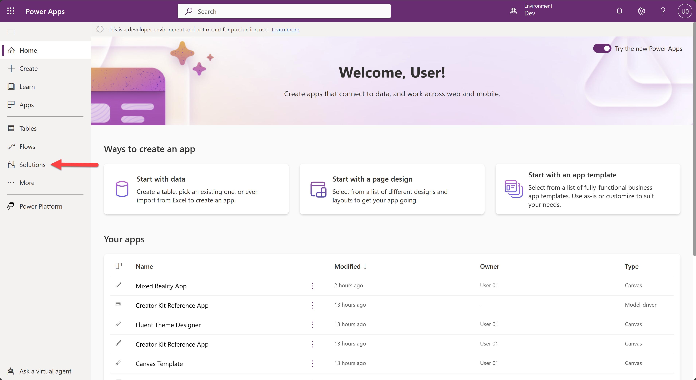

5. In the ```Solutions``` view, look for the ```Mixed Reality Workshop``` solution and then click on it's Display name.

    You should see two solution components. The first is the **Mixed Reality App** Canvas App and the second is the **Smithsonian 3D** Custom Connector that we have been working with in this lab.

    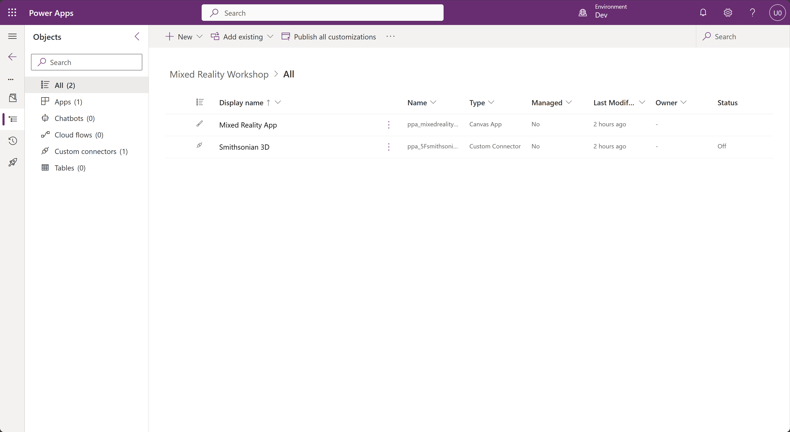

6. Click on the **Mixed Reality App** Canvas App to open it in the Power Apps Studio

7. A popup dialog will appear asking you for permission to sign into the **Smithsonian 3D** Custom Connector and the **OneDrive for Business** connector. Click **Allow**

    

    The **Smithsonian 3D** Custom Connector is used to connect to the Smithsonian 3D API to the Mixed Reality App. The **OneDrive for Business** connector is used to connect to the OneDrive folder to access the files that we uploaded in a previous task.

8. Dismiss the **Welcome to Power Apps Studio** dialog by clicking **Skip**

    You should now be on the home page of the **Mixed Reality App** Canvas App.

    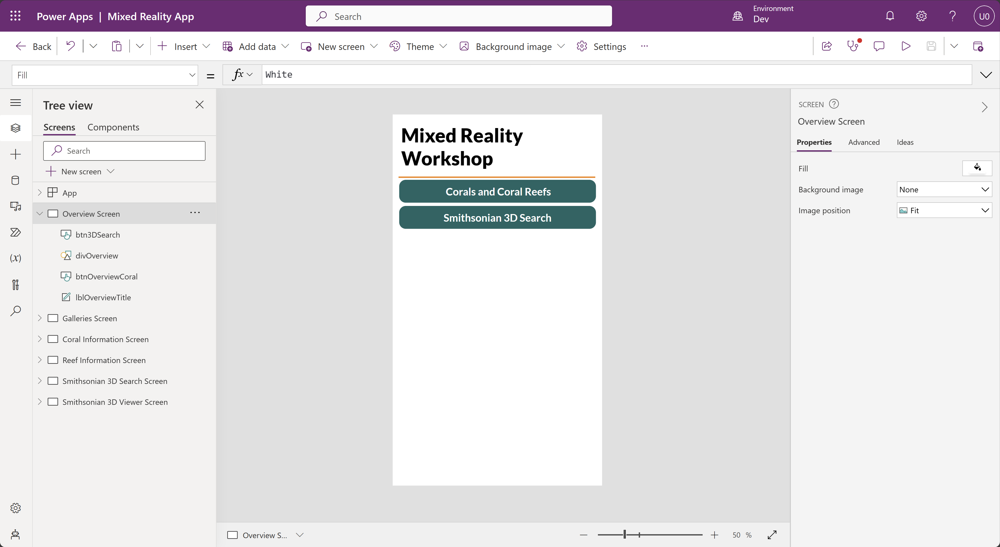

    Before we can run the app, we need to reconfigure the Datasource connections. Specifically, the **OneDrive for Business** connection. Since the initial solution was imported from a different environment, the connection is pointing to the wrong OneDrive folder. Let's go ahead and fix that.

9. Click on the **Data** icon in the left navigation bar, then click on the **More action** icon next to "Coral" and then select **Remove**

    

10. Click on the **Data** icon in the left navigation bar, then click on the **More action** icon next to "Occupants" and then select **Remove**

    

11. Now with the old connections to OneDrive removed, let's add new ones. Click on the **Add Data** button and then expand the "Connectors" tab and select **OneDrive for Business**

    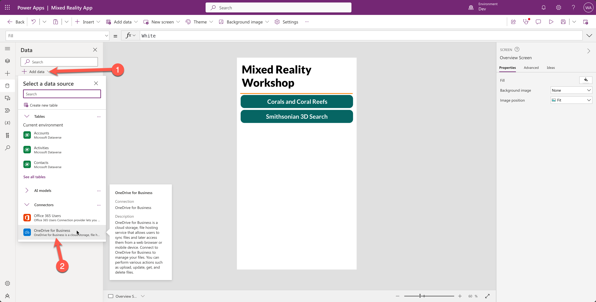

12. Select **OneDrive for Business** once more

    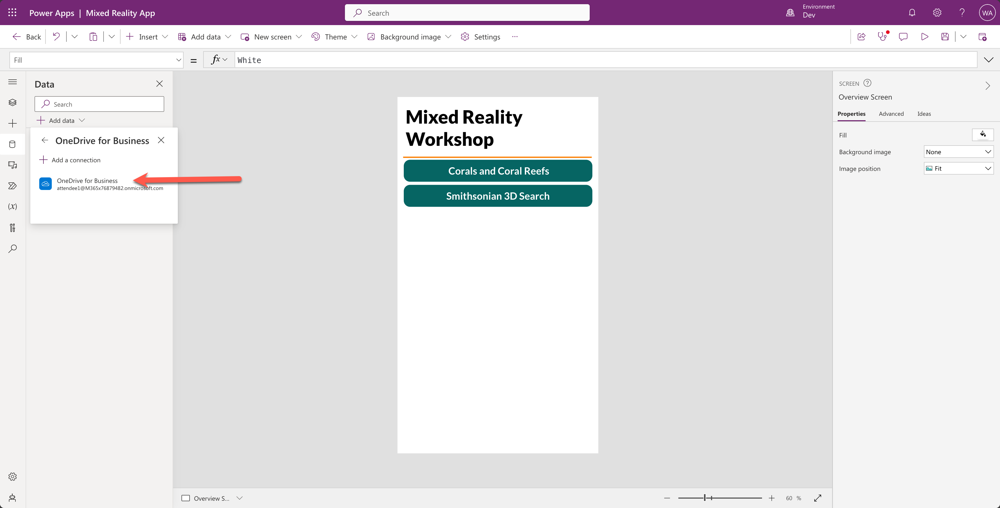

    A popup window will appear on the right-hand side asking you to choose an Excel file. 

13. Click on the **Coral Collection** folder

    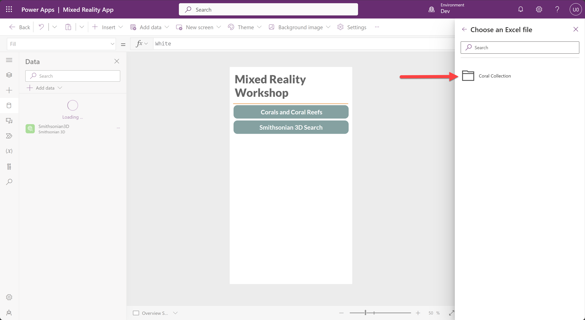

14. Select the **CoralCollection.xlsx** file

    

15. Next, select _both_ **Coral** and **Occupants** tables and then click **Connect**

    

    The **Coral** and **Occupants** tables will be added to the **Data** panel.

    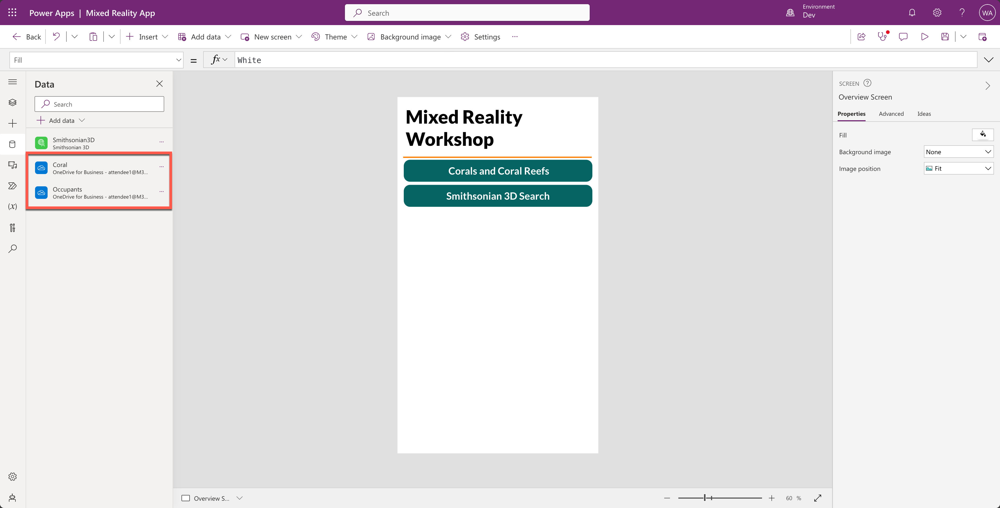

16. Now that we have the correct data sources connected, let's go ahead and run the app. Click on the **Play** button in the top right-hand corner of the screen

    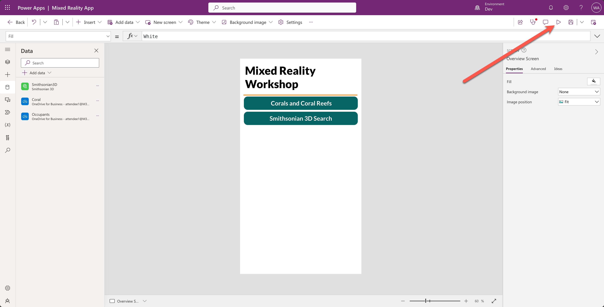

17. When the app loads - Click on the **Corals and Coral Reefs** button

    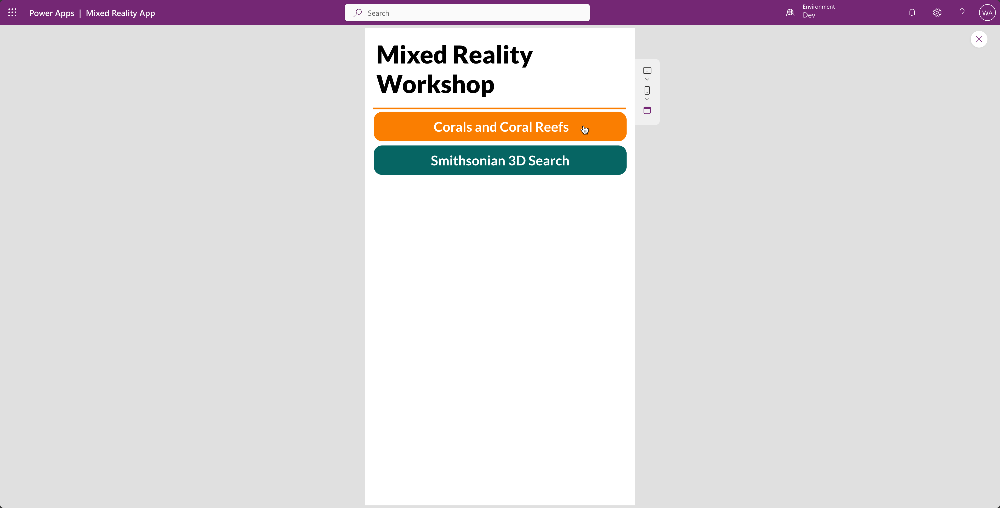

    You should see a gallery of Corals and Reef Occupants. This also proves that the **OneDrive for Business** connection is working correctly as the data is being pulled from the Excel file in the OneDrive folder.

    

18. Next, select the first coral to check if the coral 3D object works

    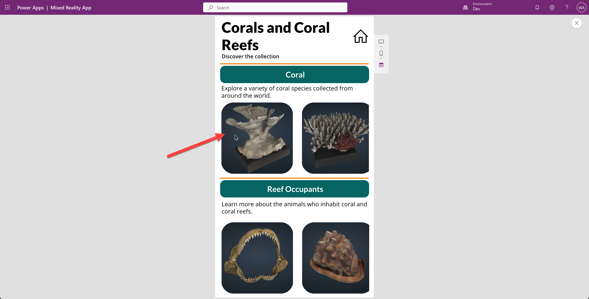

    The next screen should show a 3D object of the coral you just selected. You can rotate the object by clicking and dragging on it. You can also zoom in and out by using the scroll wheel on your mouse.

    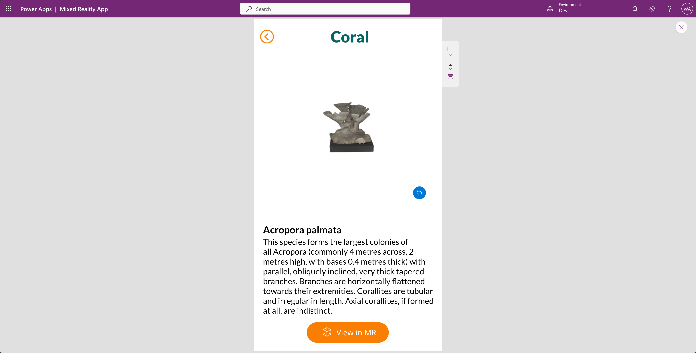

Now you know the app works in the **Dev** Environment. Let's go ahead and learn about pipelines!

## Next lab

This is the end of lab 02, select the link below to move to the next lab.

[⏭️ Move to lab 03](../lab-03/README.md)
