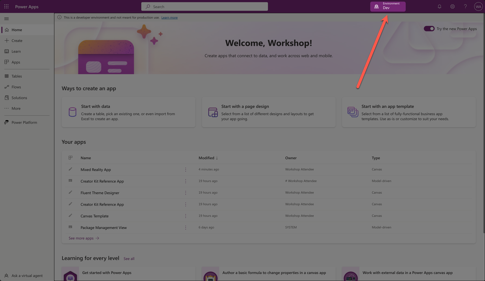
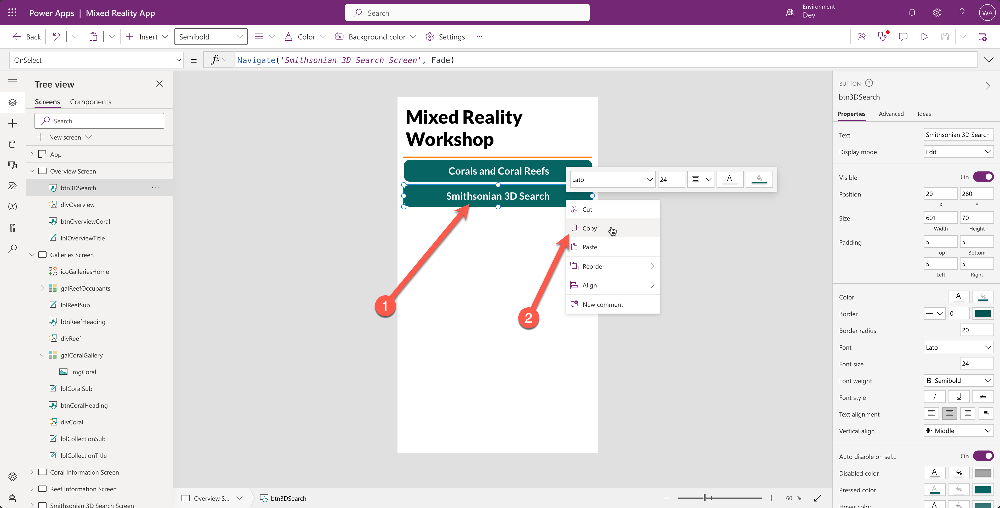
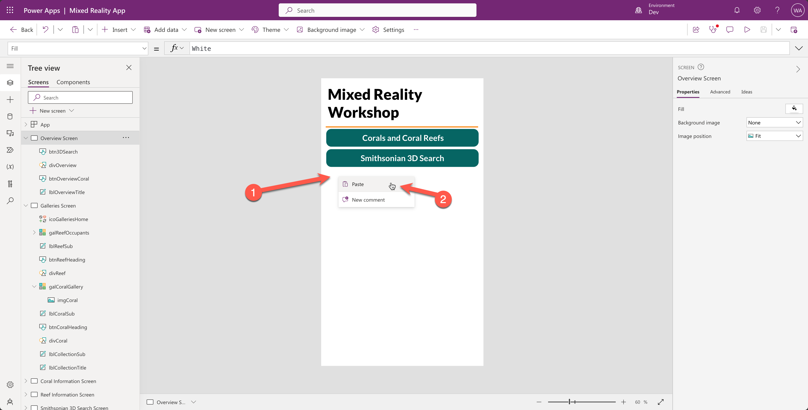
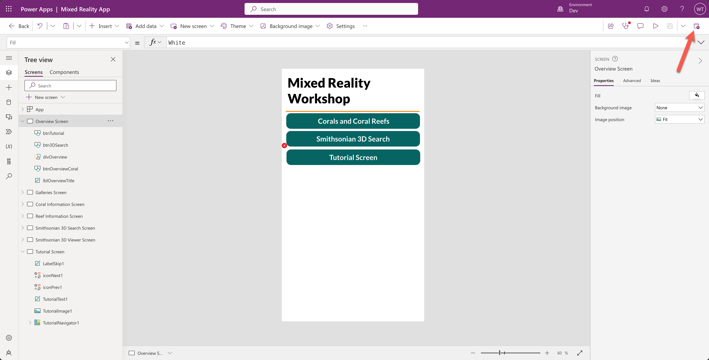
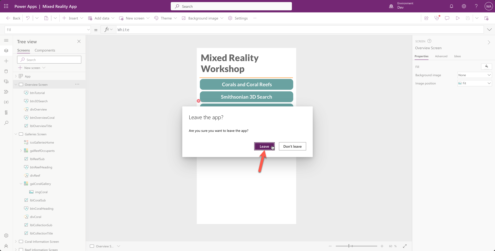

# Lab 03 - Work with solutions with a team

In Lab 02 you learned how to work with solutions. Now we are going to focus on building solutions when you're in a team. 

In this lab, you will have to imagine you're someone else. You will pretend you are your colleague in the following tasks:

* Add a screen to the MR app
* Create a new branch
* Sync the updated solution to the new branch
* Run the solution checker
* Commit the changes to the new branch
* Create a pull request (PR)

## Task 01: Add a screen to the MR app

In this task, you will act like you're a colleague who wants to change the Mixed Reality solution you imported in lab 02. 

1. Go to the [maker portal](https://make.powerapps.com)
1. Check if you are in the `Dev` environment and if not, switch to that environment
        
1. Go to Solutions via the left menu
1. Select the `Mixed Reality Workshop` solution by selecting the display name
        
1. Select the `elipsis` and select `Edit`
        
1. Select `New screen`, select `Templates`, and select the `Tutorial` screen
        
1. In the tree view on the left scroll down until you see `Screen2`, select the `elipsis` next to it, and select `Rename`
        
1. Select the `Overview Screen`, right-click on the `Smithsonian 3D Search` button and select `Copy`
        
1. Right-click on the screen and select `Paste` to paste a copy of the button
        
1. Position the button below the others, add the following formula (yes, this is an incorrect formula, but you will learn why later in this lab) for the `OnSelect` property in the formula bar:  
    `Navigate('Tutorial Screen', Fade`  
    Change the `text` property on the right to:  
    `Tutorial Screen`
        
1. Select the `elipsis` next to `btn3DSearch_1`, select `Rename`, and rename the button to `btnTutorial`
        
1. Save the app and publish it
        
1. Select the purple `Publish this version` button
        
1. Select back to go back to the solution
        
1. Confirm that you want to leave the app
        
1. In the solution explorer, select the `Publish all customizations` button in the command bar at the top
        

These were all the changes you had to do for the MR app. Let's move onto the next task.

## Task 02: Create a new branch

In this task, you will learn how to create a new branch in GitHub. 

1. Go back to your forked environment
1. Open up your Codespace by selecting `Code` and selecting your Codespace
        

## Task 03: Sync the updated solution to the new branch

TODO

## Task 04: Run the solution checker

TODO

## Task 05: Commit the changes to the new branch

TODO

## Task 06: Create a pull request (PR)

TODO

## Next lab

[⏭️ Move to lab 04](../lab-04/README.md)
