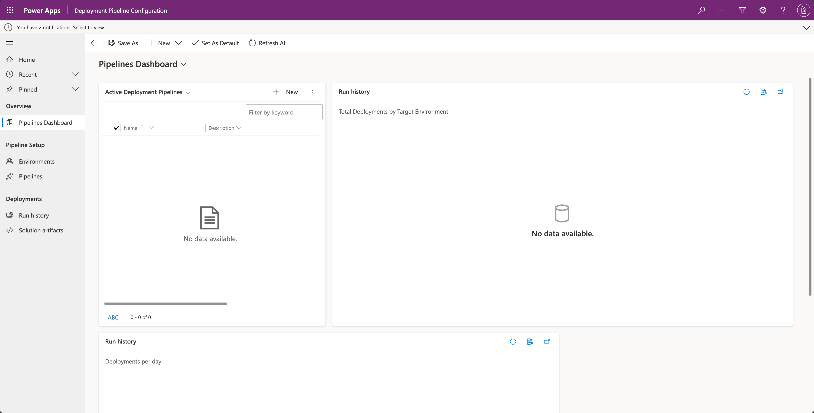
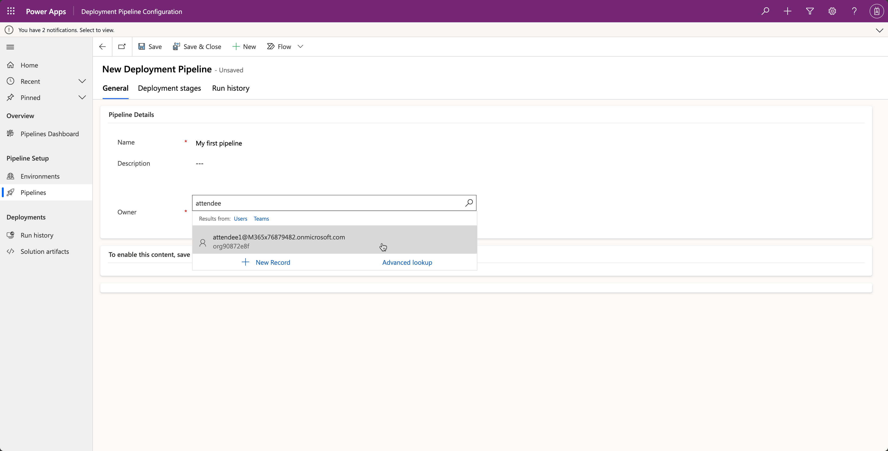

# Lab 04 - Deploy the solution to test and production environments

In this lab, you will work on the outer loop. You will perform the following tasks:

* Deploy the pipelines solution to your dev environment
* Setup your first pipeline
* Create a first deployment of the imported solution from lab 02

## Task 1: Deploy the pipelines solution to your dev environment

In this task, you will learn how to install the pipelines for Power Platform solution in your dev environment. This solution is needed to configure pipelines. Normally you would install this on a seperate environment, but in this case, you will install it on the dev environment.

1. Go to the [Power Platform Admin Center](https://aka.ms/ppac)

1. Select the `Dev` environment you created before
1. In the command bar at the top, select `Resources` and `Dynamics 365 apps` 

1. Here you can find the apps that are installed on your `Dev` environment by default. Select the `Install App` button in the command bar at the top

1. In the sidebar that opens, scroll all the way down select the `Power Platform Pipelines` app and select the `Next` button at the bottom of the sidebar

1. Next, make sure to agree to the terms and select the `Install` button at the bottom of the sidebar

This process will take a couple of minutes, you can refresh the page by selecting the `Refresh` button in the command bar at the top.

When finished, you can go to the [maker portal](https://make.powerapps.com) and select the right environment (`Dev`). If all went well, you should be able to see the `Deployment Pipeline Configuration` app in the Apps section in the maker portal.

## Task 02: Setup your first pipeline

In this task, you will create your first pipeline. The `Deployment Pipeline Configuration` app will be used for that. 

Make sure to select that app in the [maker portal](https://make.powerapps.com) and make sure to play the app.

This will open the app in a new tab:

Make yourself familiar with the app, by looking around which menu items there are: 

First, there is an `Overview` section, where you land when you open the app. This is the `Pipelines Dashboard`, which will show you the latest info about runs and pipelines that are active. When you open this for the first time, it's supposed to be empty, so don't worry! 

There is also a `Pipeline Setup` section where you can view your environments and pipelines. 

Last but not least, there is a `Deployments` section which enables you to view the run history and find solution artifacts.

### Create a new pipeline

Let's create a new pipeline, by selecting the new button on the `Pipelines Dashboard`.

This will lead you to a form where you can enter details about your pipeline:

1. Use `My first pipeline` as the name
1. In the owner field, make sure to look for the email address of your account and select your user
1. Save the pipeline

Some components of the form only appear after the first save, so that's why we save the pipeline. After saving, scroll down and you will see the following screen: 

As you can see there are two sections:

* **Linked Development Environments**
* **Deployment Stages (Deployment Pipeline)**

A pipeline can be available for multiple development environments. This is very convenient when you want to use multiple development environments and use shared test and shared production environments.
