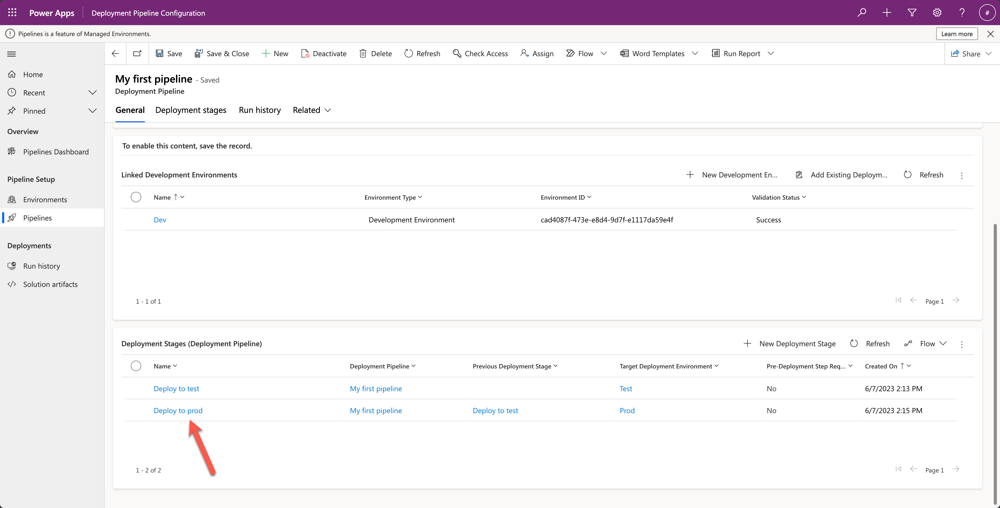
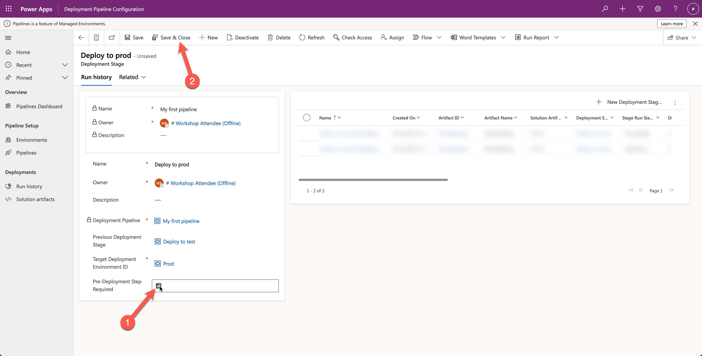
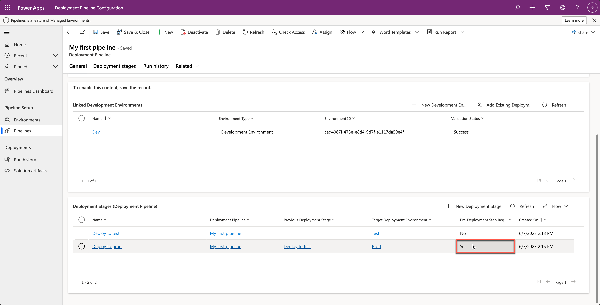
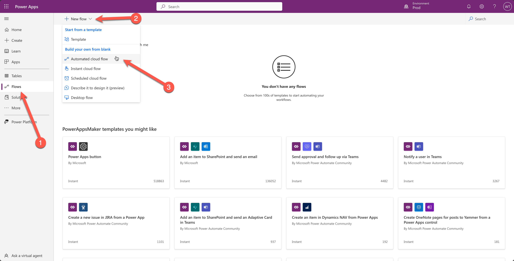
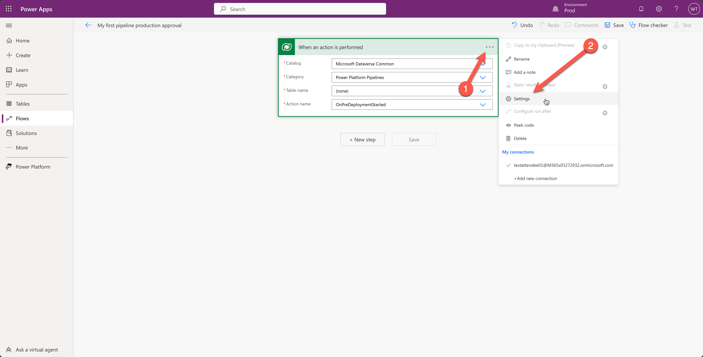

# Lab 05 - Add an approval before deploying to production

This lab will consist of the following tasks:

* Extending the pipeline in the Deployment Pipeline Configuration App
* Create a cloud flow that handles the approval

## Task 1: Extending the pipeline in the Deployment Pipeline Configuration App

In this task, you will learn how to extend the pipeline and add an approval before deploying to production.

1. Go to the [maker portal](https://make.powerapps.com)
1. Check if you are in the `Dev` environment and if not, switch to that environment
    
1. Look for the `Deployment Pipeline Configuration` app, hover on it and select the play button
    
1. This will open the `Deployment Pipeline Configuration` app and will enable you to modify your pipeline. Select the `My first pipeline` pipeline
    
1. On the next screen, scroll down to the deployment stages and select the `Deploy to prod` deployment stage by selecting the name
    
1. Enable the check box in the `Pre-Deployment Step Required` field and select the `Save & Close` button in the command bar at the top
    
1. Check in the Deployment Stages subgrid if the `Pre-Deployment Step Required` field is changed to yes. If that's correct, you are done with this task, if not, go back to step 5 and try again 
    

## Task 2: Create a cloud flow that handles the approval

In this task, you will learn how to create an approval flow that will handle the approval before deploying to production.

1. Go to the [maker portal](https://make.powerapps.com)
1. Check if you are in the `Dev` environment and if not, switch to that environment
    
1. Select `Flows` in the left navigation, select `New flow` in the command bar at the top and select `Automated cloud flow` 
    
1. This will open a pop up where you can name your flow and configure a trigger. Name your flow `My first pipeline production approval`, search for `action`, select the Microsoft Dataverse trigger called `When an action is performed` and select the blue `Create` button.  
    
1. Configure the trigger inputs by making it look like the screenshot below
    
1. Select the ellipsis at the top-right corner of the trigger and select settings to open up the trigger settings
    
