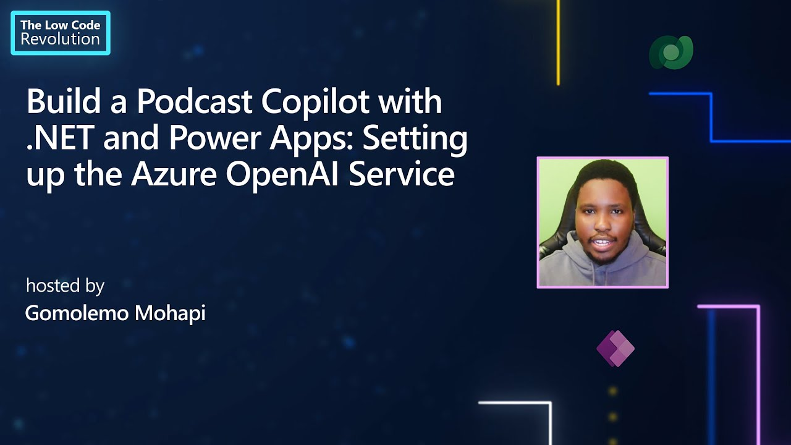
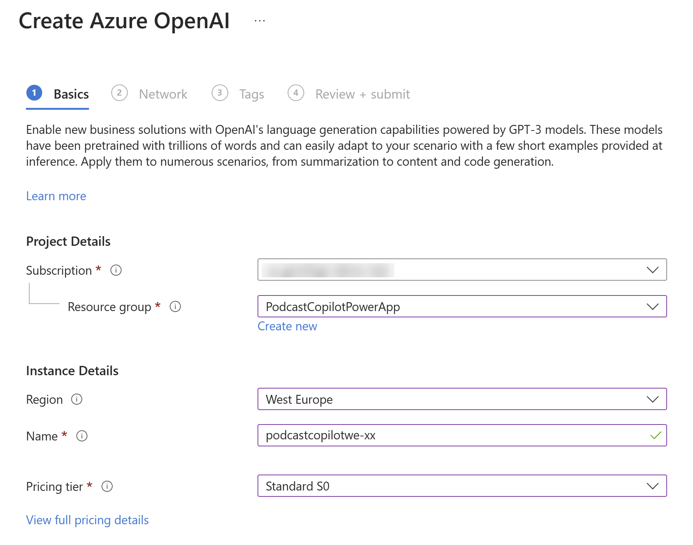
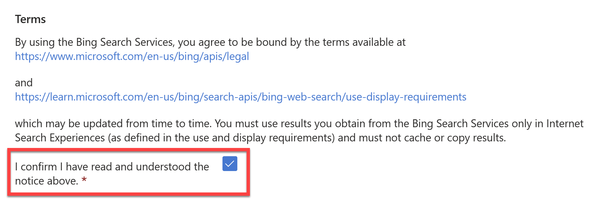
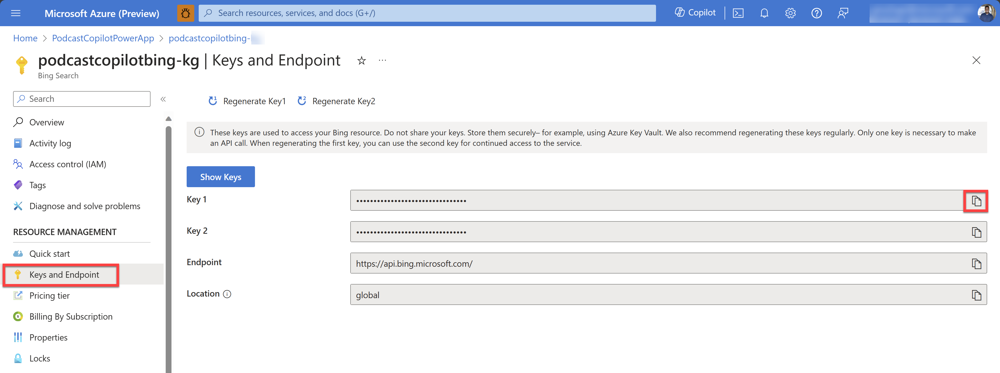
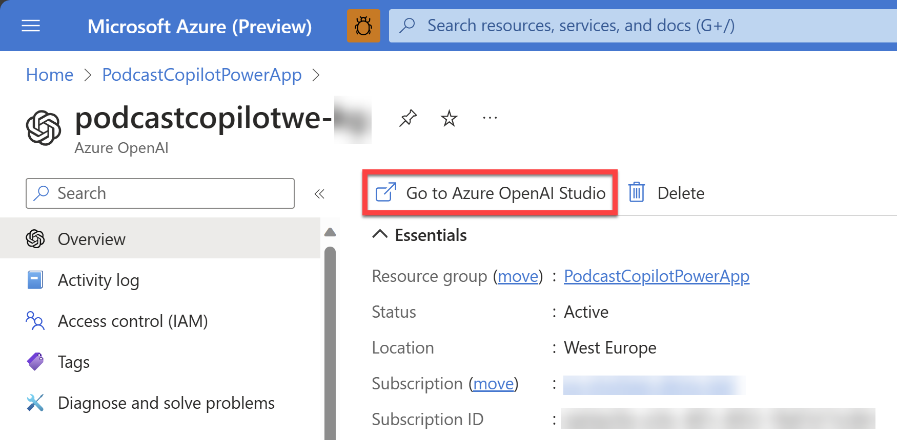
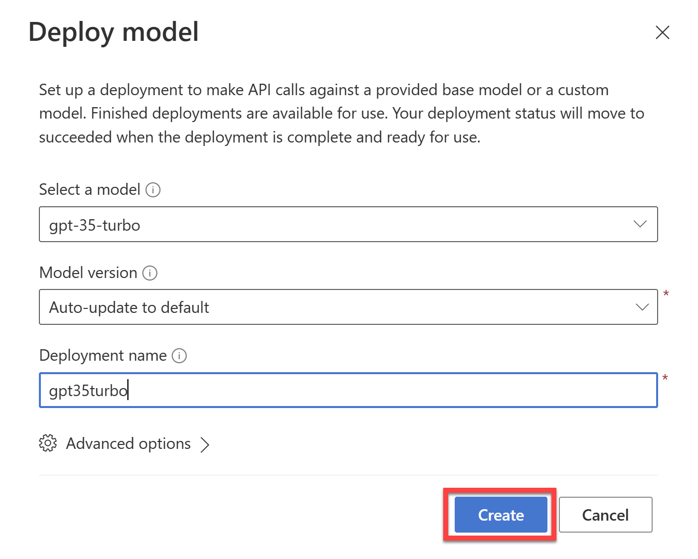
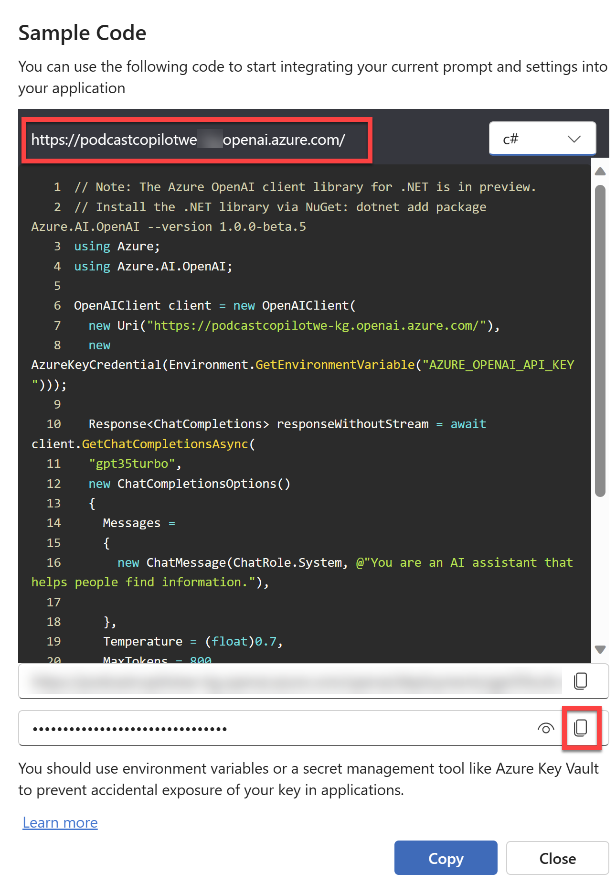
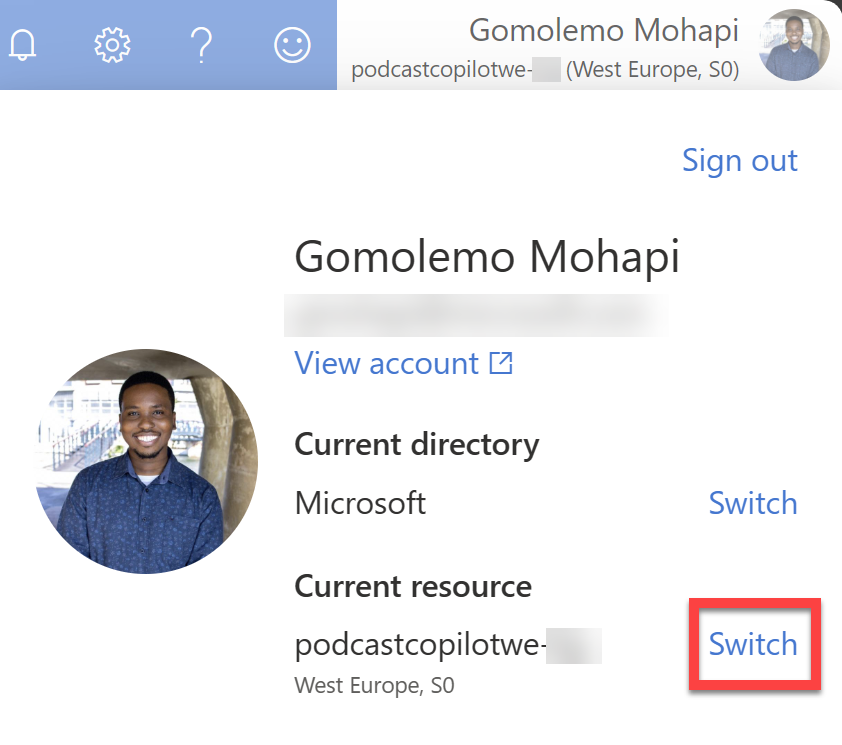
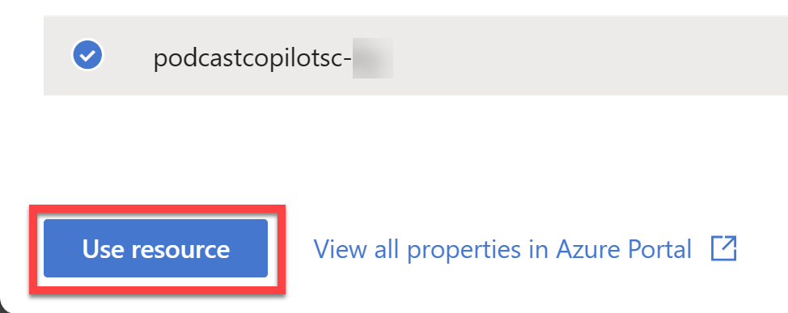

# Lab 1 - Laying the Foundation: Azure OpenAI Service and Power Platform

## Background

Dive into the world of Azure OpenAI Service. We introduce the service, describe the models, and guide you through creating deployments. Setting the stage for seamless AI integration.

## Definitions

### What is Azure OpenAI Service?

Azure OpenAI Service provides REST API access to OpenAI's powerful language models including the GPT-4, GPT-4 Turbo with Vision, GPT-3.5-Turbo, and Embeddings model series. In addition, the new GPT-4 and GPT-3.5-Turbo model series have now reached general availability. These models can be easily adapted to your specific task including but not limited to content generation, summarization, image understanding, semantic search, and natural language to code translation. Users can access the service through REST APIs, Python SDK, or our web-based interface in the Azure OpenAI Studio.

Learn More: [What is Azure OpenAI Service? [Microsoft Learn]](https://learn.microsoft.com/en-us/azure/ai-services/openai/overview)

## Prerequisites

For this lab, make sure you have the following ready:

- An active [Azure Subscription](https://azure.microsoft.com/en-us/free/)
- Access to [Azure OpenAI Service](https://azure.microsoft.com/en-us/services/openai/)

### Video Overview of Lab:

Date of Livestream: {TBD}

## Instructions

### Creating the Azure OpenAI Service Resources

1. Go to [portal.azure.com](portal.azure.com) and login with your Azure account.

1. Search for and select **Resource Groups**.

1. Click on **+ Create**.

    

1. Name it `PodcastCopilotPowerApp` and click on **Review + Create**. Then click on **Create**.

1. Create a new Azure OpenAI Service resource by clicking [here](https://ms.portal.azure.com/#create/Microsoft.CognitiveServicesOpenAI) and set the following parameters:

    - **Name**: `podcastcopilotwe-{your initials}` (e.g. `podcastcopilotwe-jd` to make it unique)
    - **Subscription**: Select your Azure subscription
    - **Resource Group**: Select the resource group you created in the previous step
    - **Location**: `West Europe`
    - **Pricing Tier**: Select the `Standard S0` pricing tier

    This resource will be used to access the Whisper and GPT-3.5 models.

    

1. Click on **Next** until you get to the **Review + Submit** page and then click on **Create** to create the resource.

1. Create another new Azure OpenAI Service resource by clicking [here](https://ms.portal.azure.com/#create/Microsoft.CognitiveServicesOpenAI) and set the following parameters:

    - **Name**: `podcastcopilotsc-{your initials}` (e.g. `podcastcopilotsc-jd` to make it unique)
    - **Subscription**: Select your Azure subscription
    - **Resource Group**: Select the resource group you created in the previous step
    - **Location**: `Sweden Central`
    - **Pricing Tier**: Select the `Standard S0` pricing tier

    This resource will be used to access the Dall.E 3 model.

1. Click on **Next** until you get to the **Review + Submit** page and then click on **Create** to create the resource.

### Creating the Bing Search Resource in Azure

1. Next we will create a Bing Search resource in Azure. Click this [link](https://ms.portal.azure.com/#create/Microsoft.BingSearch) and set the following parameters:

    - **Name**: `podcastcopilotbing-{your initials}` (e.g. `podcastcopilotbing-jd` to make it unique)
    - **Subscription**: Select your Azure subscription
    - **Resource Group**: Select the resource group you created in the previous step
    - **Region**: `Global`
    - **Pricing Tier**: Select the `F1` pricing tier

1. Read the **Terms** and **Notice** and select the checkbox to agree to them.

    

1. Click on **Review + Create** and then **Create** to create the resource.

1. Open up your `PodcastCopilotPowerApp` resource group in the Azure portal.

1. Select the `podcastcopilotbing-{your initials}` resource.

1. Select **Keys and Endpoint** on the left menu and note down the **Key 1** value somewhere safe.

    

### Creating model deployments in Azure OpenAI Studio

1. Open up your `PodcastCopilotPowerApp` resource group in the Azure portal.

1. Select the `podcastcopilotwe-{your initials}` resource.

1. On the top menu, click on **Go to Azure OpenAI Studio**.

    

1. In the Azure OpenAI Studio, click on **Deployments** on the left menu.

1. Click on **+ Create New Deployment** and set the following parameters:

    - **Select a model**: `GPT-35-Turbo`
    - **Model version**: `Auto-update to default`
    - **Deployment name**: `gpt35turbo`

    Click **Create** to create the deployment.

    

1. Click on **+ Create New Deployment** again and set the following parameters:

    - **Select a model**: `whisper`
    - **Model version**: `Auto-update to default`
    - **Deployment name**: `whisper`

    Click **Create** to create the deployment.

1. Select the **gpt35turbo** deployment and click on **Open in Playground**.

    

1. In the playground, click on **View Code** and note down the following somewhere safe:

    - **Deployment Name**: `gpt35turbo`
    - **Endpoint**: `https://podcastcopilotwe-{your initials}.openai.azure.com/`
    - **Key**: `xxxxxxxxxxxxxxxxxxxxxxxxxxxxxxxx`

    

1. Once complete, do the same for the `whisper` deployment.

1. Click on **Deployments** on the left menu and select the **whisper** deployment. Then click on **Open in Playground**.

1. Scroll down to the **Next Steps** section, select the **podcastcopilotsc-{your initials}** resource and then note down the following somewhere safe:

    - **Deployment Name**: `whisper`
    - **Endpoint**: `https://podcastcopilotwe-{your initials}.openai.azure.com/`
    - **Resource Key**: `xxxxxxxxxxxxxxxxxxxxxxxxxxxxxxxx`

1. Now in the top right corner, click on your name and then under `Current Resource`; select **Switch**.

    

1. Select the **podcastcopilotsc-{your initials}** resource and then select **Use Resource**.

    

1. Click on **Deployments** on the left menu and then select **Create New Deployment** and set the following parameters:

    - **Select a model**: `dall-e-3`
    - **Model version**: `Auto-update to default`
    - **Deployment name**: `dalle3`

    Click **Create** to create the deployment.

1. Select the **dalle3** deployment and click on **Open in Playground**.

1. Select **View Code** and note down the following somewhere safe:

    - **Deployment Name**: `dalle3`
    - **Endpoint**: `https://podcastcopilotsc-{your initials}.openai.azure.com/`
    - **Key**: `xxxxxxxxxxxxxxxxxxxxxxxxxxxxxxxx`

### Uploading Podcast Snippet to Azure Blob Storage

We'll be using Azure Blob Storage to store the podcast snippet audio file. This will allow us to easily test our API and application with a real-world audio file.

1. Navigate to the [PodcastSnippet.mp3 file](../PodcastSnippet.mp3) within this repository and download it to your local machine.

1. Go to [portal.azure.com](portal.azure.com) and login with your Azure account.

1. Navigate to [Create a storage account](https://ms.portal.azure.com/#create/Microsoft.StorageAccount-ARM) and set the following parameters:

    - **Subscription**: Select your Azure subscription
    - **Resource Group**: Select the **PodcastCopilotPowerApp** resource group
    - **Storage account name**: `podcaststorage{your initials}` (e.g. `podcaststoragejd` to make it unique)
    - **Location**: `East US`
    - **Performance**: `Standard`
    - **Redundancy**: `Geo-redundant storage (GRS)`
    - Ensure that **Make read access to data available in the event of regional unavailability** is selected`

    Click on **Review + Create** and then **Create** to create the storage account.

1. Once the storage account is created, click on **Go to resource**.

    

1. On the left-hand side, click on **Containers** and then click on **+ Container**.

    - **Name**: `audio`
    - **Public access level**: `Blob (anonymous read access for blobs only)`

    Click on **Create** to create the container.

1. Once the container is created, click on the **audio** container and then click on **Upload**.

1. 

...and that's it! You've now created all the Azure OpenAI resources you need to get started.

### ➡️ [Lab 2 - Bridging the Gap: .NET APIs, Azure and Custom Connectors](../Lab2/README.md)