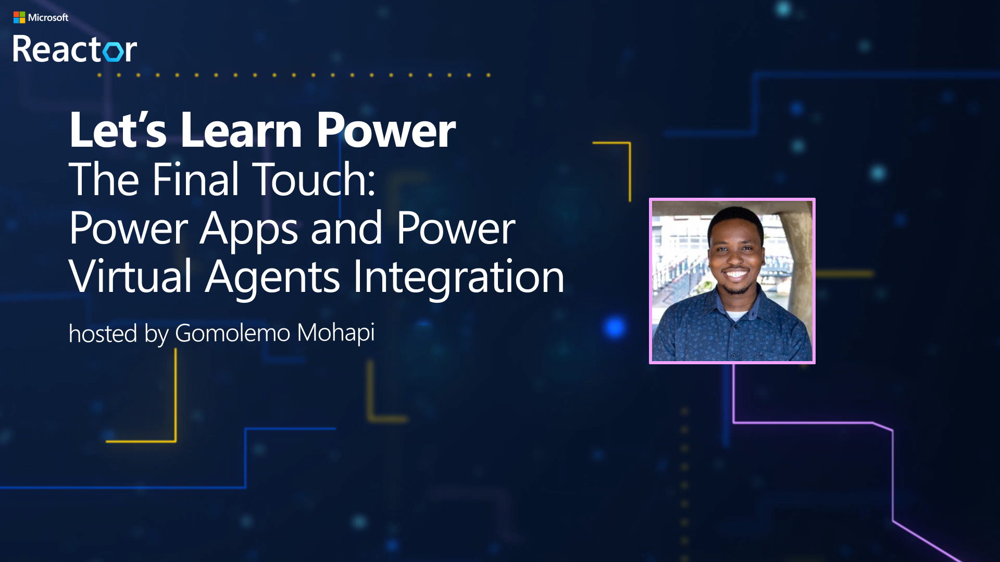

# Lab 3: The Final Touch: Power Apps and Power Virtual Agents Integration

## Background

The final lab brings it all together. We will build the Power App UI, connect to the Custom Connector, and publish the social media post to LinkedIn. As a bonus, we will also see how to implement this workflow with a Power Virtual Agents chatbot.

## Definitions

### What is Power Apps?

Power Apps is a suite of apps, services, and connectors, as well as a data platform, that provides a rapid development environment to build custom apps for your business needs. Using Power Apps, you can quickly build custom business apps that connect to your data stored either in the underlying data platform (Microsoft Dataverse) or in various online and on-premises data sources (such as SharePoint, Microsoft 365, Dynamics 365, SQL Server, and so on).

Learn More: [What is Power Apps? [Microsoft Learn]](https://learn.microsoft.com/en-us/power-apps/powerapps-overview)

### What is Power Fx?

Power Fx is the low-code language that will be used across Microsoft Power Platform. It's a general-purpose, strong-typed, declarative, and functional programming language.

Learn More: [Microsoft Power Fx overview [Microsoft Learn]](https://learn.microsoft.com/en-us/power-platform/power-fx/overview)

## Prerequisites

For this lab, just make sure you've completed the previous two labs.

### Video Overview of Lab:



Date of Livestream: {TBD}

## Instructions

### Creating the Power App

1. Log into [Power Apps](https://make.powerapps.com/) and sign in with your Power Apps Developer account.

1. Create a new **Canvas App from blank**.

1. Add the following controls to the screen:

    - 1 x **Text Input** control
    - 1 x **Button** control
    - 1 x **Label** control
    - 1 x **Image** control

    The **Text Input** control will be used to enter the link to the Podcast URL. The **Button** control with the text ``Generate Post`` will fire up the Custom Connector to generate the social media post and image. The **Label** control will display the generated post. The **Image** control will display the generated image.

1. Once you have the controls added, select the **Data** tab on the left-hand side of the screen. Click **+Add data** and search for ``PodcastCopilot_Connector``.

1. Select the connector and click **Connect**.

1. Once the connector has been added to the app, select the **Button** control and add the following formula to the **OnSelect** property:

    ```
    //Get Transcription
    Set(
        transcription,
        PodcastApp_Connector.GetTranscription(TextInput2.Text).text
    );
    //Get Guest Name
    Set(
        guestName,
        First(PodcastApp_Connector.GetGuestName(transcription).choices).message.content
    );
    //Get Guest Bio
    Set(
        guestBio,
        PodcastApp_Connector.GetGuestBio(guestName).bio
    );
    //Get Social Media Blurb
    Set(
        socialMediaBlurb,
        First(
            PodcastApp_Connector.GetSocialMediaBlurb(
                transcription,
                guestBio
            ).choices
        ).message.content
    );
    //Get DallE Prompt
    Set(
        dallePrompt,
        First(PodcastApp_Connector.GetDallEPrompt(socialMediaBlurb).choices).message.content
    );
    //Get Image
    Set(
        socialImage,
        PodcastApp_Connector.GetImage(dallePrompt).url
    )
    ```

    This formula will call every action in the Custom Connector that represents the steps for the Podcast Copilot. The resulting social media blurb will be stored in a variable called ``socialMediaBlurb``. The resulting image will be stored in a variable called ``socialImage``.

1. Now select the **Label** control and add the following formula to the **Text** property:

    ```
    socialMediaBlurb
    ```

    This will display the social media blurb in the label.

1. Finally select the **Image** control and add the following formula to the **Image** property:

    ```
    socialImage
    ```

    This will display the image in the image control.

1. Use the **Preview** button to test the app. Enter the link to the podcast episode in the **Text Input** control and click the **Generate Post** button. The social media blurb and image should be displayed.

...and that's it! You've successfully built a Power App that uses the Custom Connector to generate a social media post and image from a Podcast URL using AI!

Because the main functionality of the app is encapsulated in the Custom Connector, you can easily reuse this connector in other Power Apps or other parts of the Power Platform including Microsoft Copilot Studio. Watch the video above to see how to use the connector in Microsoft Copilot Studio.
